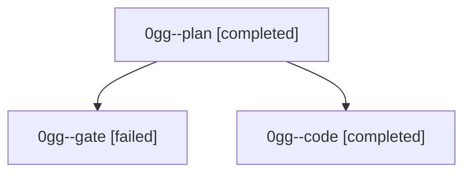

# Family: 0gg

[Agent Hoods](../README.md) / [bbugyi200](../users/bbugyi200/README.md) / [athena](../users/bbugyi200/machines/athena/README.md) / [0gg](../users/bbugyi200/machines/athena/hoods/0gg/README.md) / 0gg

Owner: `bbugyi200.athena` · Hood: `0gg` · Members: 3

## Lineage

The diagram is an optional enhancement; the ordered table below contains the same lineage in accessible text.

| Role | Agent | State | Model / provider | Timing | Commits | Prompt | Chat |
|---|---|---|---|---|---:|---|---|
| plan | 0gg--plan | completed | claude-fable-5 / claude | 2026-09-05T21:47:54.002104+00:00 → 2026-09-05T21:54:05.868520+00:00 | 0 | [Prompt](../agents/bbugyi200.athena.0gg--plan/prompt.md) | [Chat](../agents/bbugyi200.athena.0gg--plan/chat.md) |
| gate | 0gg--gate | failed | claude-fable-5 / claude | 2026-09-05T21:53:58.656818+00:00 → 2026-09-05T21:59:38.956811+00:00 | 0 | — | [Chat](../agents/bbugyi200.athena.0gg--gate/chat.md) |
| code | 0gg--code | completed | gpt-5.5 / codex | 2026-09-05T21:59:46.379845+00:00 → 2026-09-05T22:31:05.725733+00:00 | 0 | [Prompt](../agents/bbugyi200.athena.0gg--code/prompt.md) | [Chat](../agents/bbugyi200.athena.0gg--code/chat.md) |
