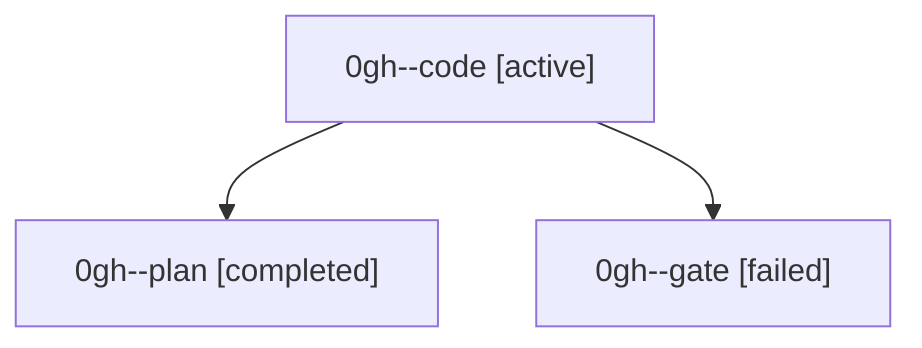

# Family: 0gh

[Agent Hoods](../README.md) / [bbugyi200](../users/bbugyi200/README.md) / [athena](../users/bbugyi200/machines/athena/README.md) / [0gh](../users/bbugyi200/machines/athena/hoods/0gh/README.md) / 0gh

Owner: `bbugyi200.athena` · Hood: `0gh` · Members: 3

## Lineage

The diagram is an optional enhancement; the ordered table below contains the same lineage in accessible text.

| Role | Agent | State | Model / provider | Timing | Commits | Prompt | Chat |
|---|---|---|---|---|---:|---|---|
| code | 0gh--code | active | gpt-5.5 / codex | 2026-09-05T22:16:52.828619+00:00 | [1](../agents/bbugyi200.athena.0gh--code/README.md#commits) | [Prompt](../agents/bbugyi200.athena.0gh--code/prompt.md) | — |
| plan | 0gh--plan | completed | gpt-6-astra / codex | 2026-09-05T22:01:23.996462+00:00 → 2026-09-05T22:13:59.922965+00:00 | 0 | [Prompt](../agents/bbugyi200.athena.0gh--plan/prompt.md) | [Chat](../agents/bbugyi200.athena.0gh--plan/chat.md) |
| gate | 0gh--gate | failed | gpt-6-astra / codex | 2026-09-05T22:13:52.598691+00:00 → 2026-09-05T22:16:45.547608+00:00 | 0 | — | [Chat](../agents/bbugyi200.athena.0gh--gate/chat.md) |

## Commits

| Role | Repo | Commit | Subject | Committed |
|---|---|---|---|---|
| code | sase | [`9f39b0a`](https://github.com/sase-org/sase/commit/9f39b0a193b1975167b305da4a85f9a07ee2814c) | perf(prompt): optimize prompt search loading | 2026-09-05 19:43:02 EDT |
