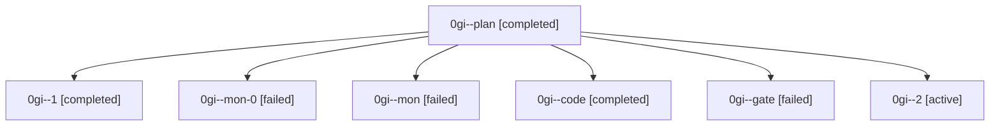

# Family: 0gi

[Agent Hoods](../README.md) / [bbugyi200](../users/bbugyi200/README.md) / [athena](../users/bbugyi200/machines/athena/README.md) / [0gi](../users/bbugyi200/machines/athena/hoods/0gi/README.md) / 0gi

Owner: `bbugyi200.athena` · Hood: `0gi` · Members: 7

## Lineage

The diagram is an optional enhancement; the ordered table below contains the same lineage in accessible text.

| Role | Agent | State | Model / provider | Timing | Commits | Prompt | Chat |
|---|---|---|---|---|---:|---|---|
| plan | 0gi--plan | completed | claude-fable-5 / claude | 2026-09-05T22:02:06.743847+00:00 → 2026-09-05T22:09:32.120661+00:00 | 0 | [Prompt](../agents/bbugyi200.athena.0gi--plan/prompt.md) | [Chat](../agents/bbugyi200.athena.0gi--plan/chat.md) |
| 1 | 0gi--1 | completed | sonnet / claude | 2026-09-05T22:28:14.702378+00:00 → 2026-09-05T22:36:28.978465+00:00 | 0 | [Prompt](../agents/bbugyi200.athena.0gi--1/prompt.md) | [Chat](../agents/bbugyi200.athena.0gi--1/chat.md) |
| mon-0 | 0gi--mon-0 | failed | sonnet / claude | 2026-09-05T22:36:19.927173+00:00 → 2026-09-05T22:40:02.942317+00:00 | 0 | — | [Chat](../agents/bbugyi200.athena.0gi--mon-0/chat.md) |
| mon | 0gi--mon | failed | sonnet / claude | 2026-09-05T22:12:36.477490+00:00 → 2026-09-05T22:27:54.952703+00:00 | 0 | — | [Chat](../agents/bbugyi200.athena.0gi--mon/chat.md) |
| code | 0gi--code | completed | sonnet / claude | 2026-09-05T22:11:23.806225+00:00 → 2026-09-05T22:12:45.575823+00:00 | 0 | [Prompt](../agents/bbugyi200.athena.0gi--code/prompt.md) | [Chat](../agents/bbugyi200.athena.0gi--code/chat.md) |
| gate | 0gi--gate | failed | claude-fable-5 / claude | 2026-09-05T22:09:24.927906+00:00 → 2026-09-05T22:11:16.125015+00:00 | 0 | — | [Chat](../agents/bbugyi200.athena.0gi--gate/chat.md) |
| 2 | 0gi--2 | active | sonnet / claude | 2026-09-05T22:40:22.733055+00:00 | [1](../agents/bbugyi200.athena.0gi--2/README.md#commits) | [Prompt](../agents/bbugyi200.athena.0gi--2/prompt.md) | — |

## Commits

| Role | Repo | Commit | Subject | Committed |
|---|---|---|---|---|
| 2 | sase | [`a945518`](https://github.com/sase-org/sase/commit/a9455184f1774d6c7553288b4b4bab378b0bb911) | chore(sase-core): ratchet core pin to fe9a643c | 2026-09-05 18:41:36 EDT |
