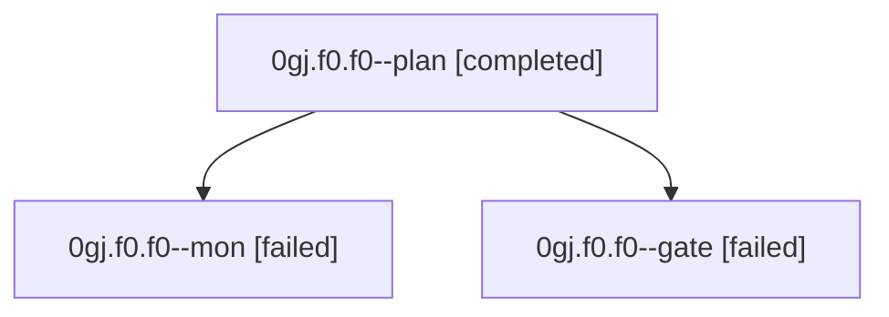

# Family: 0gj.f0.f0

[Agent Hoods](../README.md) / [bbugyi200](../users/bbugyi200/README.md) / [athena](../users/bbugyi200/machines/athena/README.md) / [0gj](../users/bbugyi200/machines/athena/hoods/0gj/README.md) / 0gj.f0.f0

Owner: `bbugyi200.athena` · Hood: `0gj` · Members: 3

## Lineage

The diagram is an optional enhancement; the ordered table below contains the same lineage in accessible text.

| Role | Agent | State | Model / provider | Timing | Commits | Prompt | Chat |
|---|---|---|---|---|---:|---|---|
| plan | 0gj.f0.f0--plan | completed | gpt-6-astra / codex | 2026-09-05T23:14:26.727783+00:00 → 2026-09-05T23:24:13.228480+00:00 | 0 | [Prompt](../agents/bbugyi200.athena.0gj.f0.f0--plan/prompt.md) | [Chat](../agents/bbugyi200.athena.0gj.f0.f0--plan/chat.md) |
| mon | 0gj.f0.f0--mon | failed | gpt-6-astra / codex | 2026-09-05T23:26:13.775102+00:00 → 2026-09-05T23:28:03.100893+00:00 | 0 | — | [Chat](../agents/bbugyi200.athena.0gj.f0.f0--mon/chat.md) |
| gate | 0gj.f0.f0--gate | failed | gpt-6-astra / codex | 2026-09-05T23:24:05.348172+00:00 → 2026-09-05T23:26:15.185075+00:00 | 0 | — | [Chat](../agents/bbugyi200.athena.0gj.f0.f0--gate/chat.md) |

## Neighbors

| Agent | Relation | State |
|---|---|---|
| [0gj.f0](bbugyi200.athena.0gj.f0.md) (family · 5) | ancestor | completed 3, failed 2 |
| [0gj](bbugyi200.athena.0gj.md) (family · 3) | ancestor | completed 2, failed 1 |
