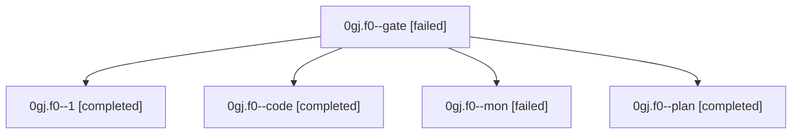

# Family: 0gj.f0

[Agent Hoods](../README.md) / [bbugyi200](../users/bbugyi200/README.md) / [athena](../users/bbugyi200/machines/athena/README.md) / [0gj](../users/bbugyi200/machines/athena/hoods/0gj/README.md) / 0gj.f0

Owner: `bbugyi200.athena` · Hood: `0gj` · Members: 5

## Lineage

The diagram is an optional enhancement; the ordered table below contains the same lineage in accessible text.

| Role | Agent | State | Model / provider | Timing | Commits | Prompt | Chat |
|---|---|---|---|---|---:|---|---|
| gate | 0gj.f0--gate | failed | gpt-6-astra / codex | 2026-09-05T22:57:29.618628+00:00 → 2026-09-05T22:59:37.321651+00:00 | 0 | — | [Chat](../agents/bbugyi200.athena.0gj.f0--gate/chat.md) |
| 1 | 0gj.f0--1 | completed | sonnet / claude | 2026-09-05T23:05:49.322748+00:00 → 2026-09-05T23:13:32.296880+00:00 | 0 | [Prompt](../agents/bbugyi200.athena.0gj.f0--1/prompt.md) | [Chat](../agents/bbugyi200.athena.0gj.f0--1/chat.md) |
| code | 0gj.f0--code | completed | sonnet / claude | 2026-09-05T22:59:43.621496+00:00 → 2026-09-05T23:02:55.630463+00:00 | 0 | [Prompt](../agents/bbugyi200.athena.0gj.f0--code/prompt.md) | [Chat](../agents/bbugyi200.athena.0gj.f0--code/chat.md) |
| mon | 0gj.f0--mon | failed | sonnet / claude | 2026-09-05T23:02:46.961455+00:00 → 2026-09-05T23:05:30.999601+00:00 | 0 | — | [Chat](../agents/bbugyi200.athena.0gj.f0--mon/chat.md) |
| plan | 0gj.f0--plan | completed | gpt-6-astra / codex | 2026-09-05T22:52:55.556672+00:00 → 2026-09-05T22:57:37.176803+00:00 | 0 | [Prompt](../agents/bbugyi200.athena.0gj.f0--plan/prompt.md) | [Chat](../agents/bbugyi200.athena.0gj.f0--plan/chat.md) |

## Neighbors

| Agent | Relation | State |
|---|---|---|
| [0gj](bbugyi200.athena.0gj.md) (family · 3) | ancestor | completed 2, failed 1 |
| [0gj.f0.f0](bbugyi200.athena.0gj.f0.f0.md) (family · 3) | descendant | completed 1, failed 2 |
