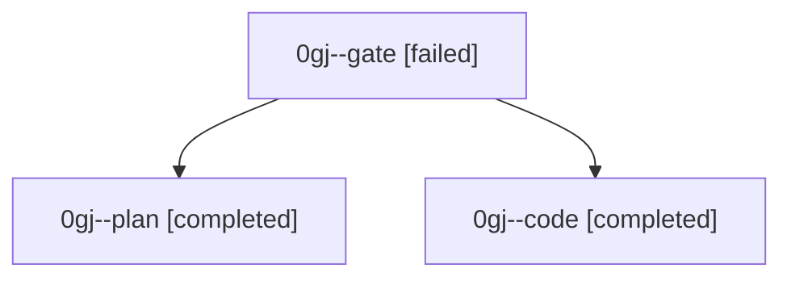

# Family: 0gj

[Agent Hoods](../README.md) / [bbugyi200](../users/bbugyi200/README.md) / [athena](../users/bbugyi200/machines/athena/README.md) / [0gj](../users/bbugyi200/machines/athena/hoods/0gj/README.md) / 0gj

Owner: `bbugyi200.athena` · Hood: `0gj` · Members: 3

## Lineage

The diagram is an optional enhancement; the ordered table below contains the same lineage in accessible text.

| Role | Agent | State | Model / provider | Timing | Commits | Prompt | Chat |
|---|---|---|---|---|---:|---|---|
| gate | 0gj--gate | failed | claude-fable-5 / claude | 2026-09-05T22:38:23.876139+00:00 → 2026-09-05T22:39:37.260414+00:00 | 0 | — | [Chat](../agents/bbugyi200.athena.0gj--gate/chat.md) |
| plan | 0gj--plan | completed | claude-fable-5 / claude | 2026-09-05T22:33:25.068019+00:00 → 2026-09-05T22:38:31.112710+00:00 | 0 | [Prompt](../agents/bbugyi200.athena.0gj--plan/prompt.md) | [Chat](../agents/bbugyi200.athena.0gj--plan/chat.md) |
| code | 0gj--code | completed | gpt-5.5 / codex | 2026-09-05T22:39:44.395819+00:00 → 2026-09-05T22:51:38.146618+00:00 | 0 | [Prompt](../agents/bbugyi200.athena.0gj--code/prompt.md) | [Chat](../agents/bbugyi200.athena.0gj--code/chat.md) |

## Neighbors

| Agent | Relation | State |
|---|---|---|
| [0gj.f0](bbugyi200.athena.0gj.f0.md) (family · 5) | descendant | completed 3, failed 2 |
| [0gj.f0.f0](bbugyi200.athena.0gj.f0.f0.md) (family · 3) | descendant | completed 1, failed 2 |
