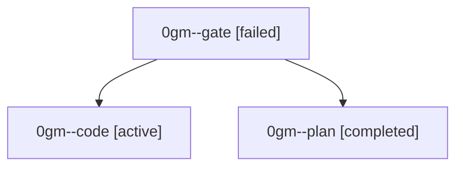

# Family: 0gm

[Agent Hoods](../README.md) / [bbugyi200](../users/bbugyi200/README.md) / [athena](../users/bbugyi200/machines/athena/README.md) / [0gm](../users/bbugyi200/machines/athena/hoods/0gm/README.md) / 0gm

Owner: `bbugyi200.athena` · Hood: `0gm` · Members: 3

## Lineage

The diagram is an optional enhancement; the ordered table below contains the same lineage in accessible text.

| Role | Agent | State | Model / provider | Timing | Commits | Prompt | Chat |
|---|---|---|---|---|---:|---|---|
| gate | 0gm--gate | failed | gpt-6-astra / codex | 2026-09-06T11:37:18.943346+00:00 → 2026-09-06T11:38:15.765696+00:00 | 0 | — | [Chat](../agents/bbugyi200.athena.0gm--gate/chat.md) |
| code | 0gm--code | active | grok-4.6 / grok | 2026-09-06T11:38:23.001333+00:00 | 0 | [Prompt](../agents/bbugyi200.athena.0gm--code/prompt.md) | — |
| plan | 0gm--plan | completed | gpt-6-astra / codex | 2026-09-06T11:30:38.596956+00:00 → 2026-09-06T11:37:26.521177+00:00 | 0 | [Prompt](../agents/bbugyi200.athena.0gm--plan/prompt.md) | [Chat](../agents/bbugyi200.athena.0gm--plan/chat.md) |
