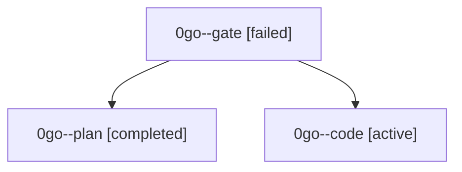

# Family: 0go

[Agent Hoods](../README.md) / [bbugyi200](../users/bbugyi200/README.md) / [athena](../users/bbugyi200/machines/athena/README.md) / [0go](../users/bbugyi200/machines/athena/hoods/0go/README.md) / 0go

Owner: `bbugyi200.athena` · Hood: `0go` · Members: 3

## Lineage

The diagram is an optional enhancement; the ordered table below contains the same lineage in accessible text.

| Role | Agent | State | Model / provider | Timing | Commits | Prompt | Chat |
|---|---|---|---|---|---:|---|---|
| gate | 0go--gate | failed | gpt-6-astra / codex | 2026-09-06T15:15:08.152242+00:00 → 2026-09-06T15:22:06.795014+00:00 | 0 | — | [Chat](../agents/bbugyi200.athena.0go--gate/chat.md) |
| plan | 0go--plan | completed | gpt-6-astra / codex | 2026-09-06T15:05:51.801484+00:00 → 2026-09-06T15:15:17.100016+00:00 | 0 | [Prompt](../agents/bbugyi200.athena.0go--plan/prompt.md) | [Chat](../agents/bbugyi200.athena.0go--plan/chat.md) |
| code | 0go--code | active | gpt-5.5 / codex | 2026-09-06T15:22:14.031027+00:00 | [1](../agents/bbugyi200.athena.0go--code/README.md#commits) | [Prompt](../agents/bbugyi200.athena.0go--code/prompt.md) | — |

## Commits

| Role | Repo | Commit | Subject | Committed |
|---|---|---|---|---|
| code | sase | [`88e6f4e`](https://github.com/sase-org/sase/commit/88e6f4ef7ebb555f7ced1e2447b8efa7c1b64304) | fix(ace): harden kill-and-edit relaunch lifecycle | 2026-09-06 12:17:58 EDT |
