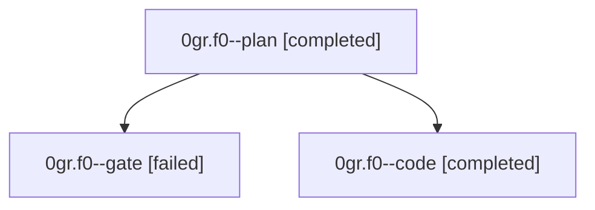

# Family: 0gr.f0

[Agent Hoods](../README.md) / [bbugyi200](../users/bbugyi200/README.md) / [athena](../users/bbugyi200/machines/athena/README.md) / [0gr](../users/bbugyi200/machines/athena/hoods/0gr/README.md) / 0gr.f0

Owner: `bbugyi200.athena` · Hood: `0gr` · Members: 3

## Lineage

The diagram is an optional enhancement; the ordered table below contains the same lineage in accessible text.

| Role | Agent | State | Model / provider | Timing | Commits | Prompt | Chat |
|---|---|---|---|---|---:|---|---|
| plan | 0gr.f0--plan | completed | claude-fable-5 / claude | 2026-09-06T18:56:41.752709+00:00 → 2026-09-06T19:15:02.848296+00:00 | 0 | [Prompt](../agents/bbugyi200.athena.0gr.f0--plan/prompt.md) | [Chat](../agents/bbugyi200.athena.0gr.f0--plan/chat.md) |
| gate | 0gr.f0--gate | failed | claude-fable-5 / claude | 2026-09-06T19:14:52.782755+00:00 → 2026-09-06T19:16:10.167603+00:00 | 0 | — | [Chat](../agents/bbugyi200.athena.0gr.f0--gate/chat.md) |
| code | 0gr.f0--code | completed | gpt-5.5 / codex | 2026-09-06T19:16:17.473941+00:00 → 2026-09-06T21:20:03.374084+00:00 | [1](../agents/bbugyi200.athena.0gr.f0--code/README.md#commits) | [Prompt](../agents/bbugyi200.athena.0gr.f0--code/prompt.md) | [Chat](../agents/bbugyi200.athena.0gr.f0--code/chat.md) |

## Commits

| Role | Repo | Commit | Subject | Committed |
|---|---|---|---|---|
| code | sase | [`78fdf65`](https://github.com/sase-org/sase/commit/78fdf65b8501c7615f67ea0979ce3d6893a4a7a2) | fix(commit): handle no-commit conflict resumes | 2026-09-06 17:16:44 EDT |

## Neighbors

| Agent | Relation | State |
|---|---|---|
| [0gr](bbugyi200.athena.0gr.md) (family · 7) | ancestor | completed 1, failed 6 |
