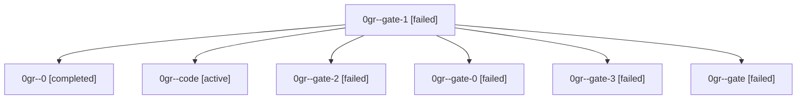

# Family: 0gr

[Agent Hoods](../README.md) / [bbugyi200](../users/bbugyi200/README.md) / [athena](../users/bbugyi200/machines/athena/README.md) / [0gr](../users/bbugyi200/machines/athena/hoods/0gr/README.md) / 0gr

Owner: `bbugyi200.athena` · Hood: `0gr` · Members: 7

## Lineage

The diagram is an optional enhancement; the ordered table below contains the same lineage in accessible text.

| Role | Agent | State | Model / provider | Timing | Commits | Prompt | Chat |
|---|---|---|---|---|---:|---|---|
| gate-1 | 0gr--gate-1 | failed | gpt-5.5 / codex | 2026-09-06T18:28:54.616670+00:00 → 2026-09-06T18:29:00.824357+00:00 | 0 | — | [Chat](../agents/bbugyi200.athena.0gr--gate-1/chat.md) |
| 0 | 0gr--0 | completed | gpt-5.6-sol / codex | 2026-09-06T18:01:24.263029+00:00 → 2026-09-06T18:13:55.509568+00:00 | 0 | [Prompt](../agents/bbugyi200.athena.0gr--0/prompt.md) | [Chat](../agents/bbugyi200.athena.0gr--0/chat.md) |
| code | 0gr--code | active | gpt-5.5 / codex | 2026-09-06T18:20:25.151411+00:00 | 0 | [Prompt](../agents/bbugyi200.athena.0gr--code/prompt.md) | — |
| gate-2 | 0gr--gate-2 | failed | gpt-5.5 / codex | 2026-09-06T18:31:37.387511+00:00 → 2026-09-06T18:31:44.672139+00:00 | 0 | — | [Chat](../agents/bbugyi200.athena.0gr--gate-2/chat.md) |
| gate-0 | 0gr--gate-0 | failed | gpt-5.6-sol / codex | 2026-09-06T18:13:38.805954+00:00 → 2026-09-06T18:20:17.790701+00:00 | 0 | — | [Chat](../agents/bbugyi200.athena.0gr--gate-0/chat.md) |
| gate-3 | 0gr--gate-3 | failed | gpt-5.5 / codex | 2026-09-06T18:35:29.438764+00:00 → 2026-09-06T18:35:35.143289+00:00 | 0 | — | [Chat](../agents/bbugyi200.athena.0gr--gate-3/chat.md) |
| gate | 0gr--gate | failed | gpt-5.6-sol / codex | 2026-09-06T18:06:18.488702+00:00 → 2026-09-06T18:06:25.149959+00:00 | 0 | — | [Chat](../agents/bbugyi200.athena.0gr--gate/chat.md) |
