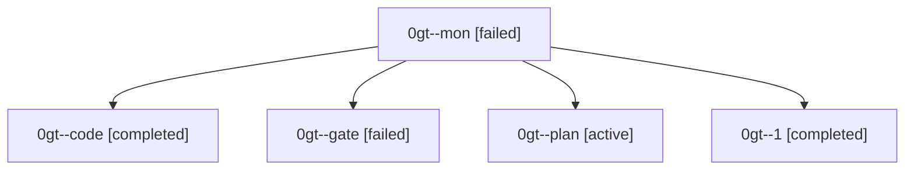

# Family: 0gt

[Agent Hoods](../README.md) / [bbugyi200](../users/bbugyi200/README.md) / [athena](../users/bbugyi200/machines/athena/README.md) / [0gt](../users/bbugyi200/machines/athena/hoods/0gt/README.md) / 0gt

Owner: `bbugyi200.athena` · Hood: `0gt` · Members: 5

## Lineage

The diagram is an optional enhancement; the ordered table below contains the same lineage in accessible text.

| Role | Agent | State | Model / provider | Timing | Commits | Prompt | Chat |
|---|---|---|---|---|---:|---|---|
| mon | 0gt--mon | failed | gpt-5.5 / codex | 2026-09-06T20:10:05.094035+00:00 → 2026-09-06T20:43:43.827687+00:00 | 0 | — | [Chat](../agents/bbugyi200.athena.0gt--mon/chat.md) |
| code | 0gt--code | completed | gpt-5.5 / codex | 2026-09-06T18:48:16.030816+00:00 → 2026-09-06T20:10:16.671852+00:00 | 0 | [Prompt](../agents/bbugyi200.athena.0gt--code/prompt.md) | [Chat](../agents/bbugyi200.athena.0gt--code/chat.md) |
| gate | 0gt--gate | failed | claude-fable-5 / claude | 2026-09-06T18:46:36.423887+00:00 → 2026-09-06T18:48:08.639528+00:00 | 0 | — | [Chat](../agents/bbugyi200.athena.0gt--gate/chat.md) |
| plan | 0gt--plan | active | claude-fable-5 / claude | 2026-09-06T18:36:12.827644+00:00 | 0 | [Prompt](../agents/bbugyi200.athena.0gt--plan/prompt.md) | [Chat](../agents/bbugyi200.athena.0gt--plan/chat.md) |
| 1 | 0gt--1 | completed | gpt-5.5 / codex | 2026-09-06T20:44:06.595880+00:00 → 2026-09-06T21:10:46.138686+00:00 | [1](../agents/bbugyi200.athena.0gt--1/README.md#commits) | [Prompt](../agents/bbugyi200.athena.0gt--1/prompt.md) | [Chat](../agents/bbugyi200.athena.0gt--1/chat.md) |

## Commits

| Role | Repo | Commit | Subject | Committed |
|---|---|---|---|---|
| 1 | sase | [`00013bb`](https://github.com/sase-org/sase/commit/00013bb5f9093f8ef46cd319fab2ade5e122b11f) | fix(finalizers): stop commit retry loop | 2026-09-06 17:07:05 EDT |
