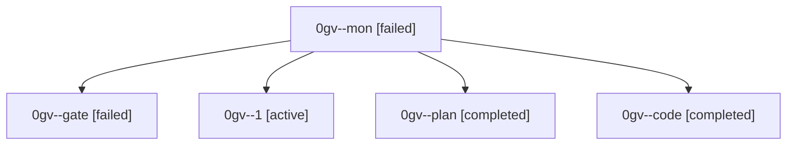

# Family: 0gv

[Agent Hoods](../README.md) / [bbugyi200](../users/bbugyi200/README.md) / [athena](../users/bbugyi200/machines/athena/README.md) / [0gv](../users/bbugyi200/machines/athena/hoods/0gv/README.md) / 0gv

Owner: `bbugyi200.athena` · Hood: `0gv` · Members: 5

## Lineage

The diagram is an optional enhancement; the ordered table below contains the same lineage in accessible text.

| Role | Agent | State | Model / provider | Timing | Commits | Prompt | Chat |
|---|---|---|---|---|---:|---|---|
| mon | 0gv--mon | failed | gpt-5.5 / codex | 2026-09-06T19:07:45.438821+00:00 → 2026-09-06T19:32:39.148965+00:00 | 0 | — | [Chat](../agents/bbugyi200.athena.0gv--mon/chat.md) |
| gate | 0gv--gate | failed | gpt-6-astra / codex | 2026-09-06T19:00:15.209400+00:00 → 2026-09-06T19:01:20.637947+00:00 | 0 | — | [Chat](../agents/bbugyi200.athena.0gv--gate/chat.md) |
| 1 | 0gv--1 | active | gpt-5.5 / codex | 2026-09-06T19:33:35.306521+00:00 | [1](../agents/bbugyi200.athena.0gv--1/README.md#commits) | [Prompt](../agents/bbugyi200.athena.0gv--1/prompt.md) | — |
| plan | 0gv--plan | completed | gpt-6-astra / codex | 2026-09-06T18:51:54.004917+00:00 → 2026-09-06T19:00:38.051497+00:00 | 0 | [Prompt](../agents/bbugyi200.athena.0gv--plan/prompt.md) | [Chat](../agents/bbugyi200.athena.0gv--plan/chat.md) |
| code | 0gv--code | completed | gpt-5.5 / codex | 2026-09-06T19:01:28.111156+00:00 → 2026-09-06T19:07:58.327618+00:00 | 0 | [Prompt](../agents/bbugyi200.athena.0gv--code/prompt.md) | [Chat](../agents/bbugyi200.athena.0gv--code/chat.md) |

## Commits

| Role | Repo | Commit | Subject | Committed |
|---|---|---|---|---|
| 1 | sase | [`d59bf50`](https://github.com/sase-org/sase/commit/d59bf500e8f5cc452023b0c4997a616004195323) | fix(tui): handle notification capital g scroll | 2026-09-06 15:58:48 EDT |
