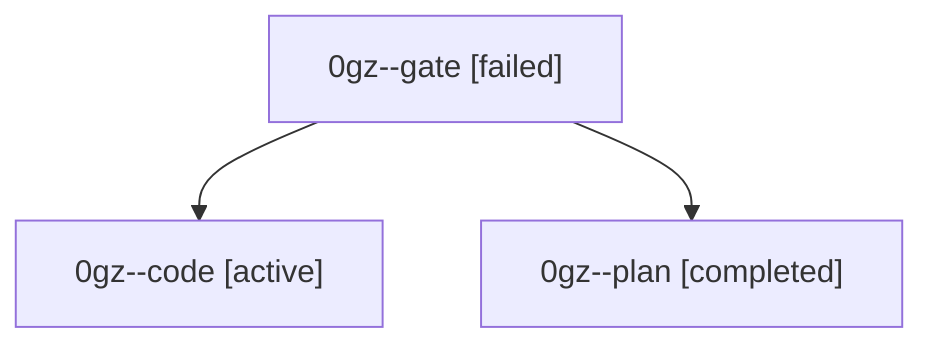

# Family: 0gz

[Agent Hoods](../README.md) / [bbugyi200](../users/bbugyi200/README.md) / [athena](../users/bbugyi200/machines/athena/README.md) / [0gz](../users/bbugyi200/machines/athena/hoods/0gz/README.md) / 0gz

Owner: `bbugyi200.athena` · Hood: `0gz` · Members: 3

## Lineage

The diagram is an optional enhancement; the ordered table below contains the same lineage in accessible text.

| Role | Agent | State | Model / provider | Timing | Commits | Prompt | Chat |
|---|---|---|---|---|---:|---|---|
| gate | 0gz--gate | failed | claude-fable-5 / claude | 2026-09-06T19:52:29.142638+00:00 → 2026-09-06T19:55:40.931381+00:00 | 0 | — | [Chat](../agents/bbugyi200.athena.0gz--gate/chat.md) |
| code | 0gz--code | active | gpt-5.5 / codex | 2026-09-06T19:55:49.958543+00:00 | [1](../agents/bbugyi200.athena.0gz--code/README.md#commits) | [Prompt](../agents/bbugyi200.athena.0gz--code/prompt.md) | — |
| plan | 0gz--plan | completed | claude-fable-5 / claude | 2026-09-06T19:35:18.191609+00:00 → 2026-09-06T19:53:06.114439+00:00 | 0 | [Prompt](../agents/bbugyi200.athena.0gz--plan/prompt.md) | [Chat](../agents/bbugyi200.athena.0gz--plan/chat.md) |

## Commits

| Role | Repo | Commit | Subject | Committed |
|---|---|---|---|---|
| code | sase | [`56754a1`](https://github.com/sase-org/sase/commit/56754a17ae5e99b3193d4d8860ae07d64e1c0d35) | fix(monitor): hold slot across follow-up handoff | 2026-09-06 16:47:19 EDT |
