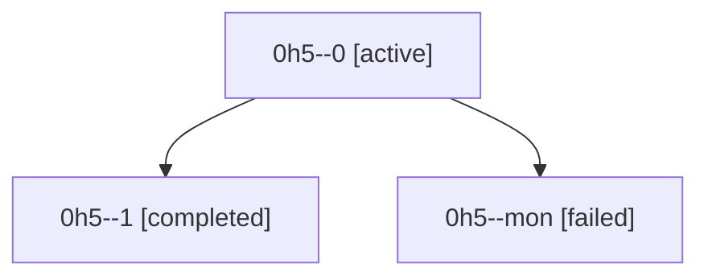

# Family: 0h5

[Agent Hoods](../README.md) / [bbugyi200](../users/bbugyi200/README.md) / [athena](../users/bbugyi200/machines/athena/README.md) / [0h5](../users/bbugyi200/machines/athena/hoods/0h5/README.md) / 0h5

Owner: `bbugyi200.athena` · Hood: `0h5` · Members: 3

## Lineage

The diagram is an optional enhancement; the ordered table below contains the same lineage in accessible text.

| Role | Agent | State | Model / provider | Timing | Commits | Prompt | Chat |
|---|---|---|---|---|---:|---|---|
| 0 | 0h5--0 | active | gpt-5.6-sol / codex | 2026-09-06T22:27:26.456159+00:00 | 0 | [Prompt](../agents/bbugyi200.athena.0h5--0/prompt.md) | [Chat](../agents/bbugyi200.athena.0h5--0/chat.md) |
| 1 | 0h5--1 | completed | gpt-5.6-sol / codex | 2026-09-06T22:53:17.342768+00:00 → 2026-09-06T22:58:48.300730+00:00 | [1](../agents/bbugyi200.athena.0h5--1/README.md#commits) | [Prompt](../agents/bbugyi200.athena.0h5--1/prompt.md) | [Chat](../agents/bbugyi200.athena.0h5--1/chat.md) |
| mon | 0h5--mon | failed | gpt-5.6-sol / codex | 2026-09-06T22:38:39.198255+00:00 → 2026-09-06T22:52:53.385604+00:00 | 0 | — | [Chat](../agents/bbugyi200.athena.0h5--mon/chat.md) |

## Commits

| Role | Repo | Commit | Subject | Committed |
|---|---|---|---|---|
| 1 | sase | [`fd48d89`](https://github.com/sase-org/sase/commit/fd48d89f1de57cb5a591256e67f62c9c95078c2a) | fix(ace): rekey launch records to durable proc ids | 2026-09-06 18:56:02 EDT |
