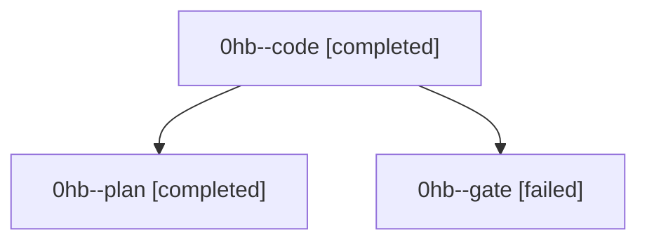

# Family: 0hb

[Agent Hoods](../README.md) / [bbugyi200](../users/bbugyi200/README.md) / [athena](../users/bbugyi200/machines/athena/README.md) / [0hb](../users/bbugyi200/machines/athena/hoods/0hb/README.md) / 0hb

Owner: `bbugyi200.athena` · Hood: `0hb` · Members: 3

## Lineage

The diagram is an optional enhancement; the ordered table below contains the same lineage in accessible text.

| Role | Agent | State | Model / provider | Timing | Commits | Prompt | Chat |
|---|---|---|---|---|---:|---|---|
| code | 0hb--code | completed | gpt-5.5 / codex | 2026-09-09T13:02:30.348683+00:00 → 2026-09-09T13:57:40.832008+00:00 | [1](../agents/bbugyi200.athena.0hb--code/README.md#commits) | [Prompt](../agents/bbugyi200.athena.0hb--code/prompt.md) | [Chat](../agents/bbugyi200.athena.0hb--code/chat.md) |
| plan | 0hb--plan | completed | gpt-6-astra / codex | 2026-09-09T12:51:22.260329+00:00 → 2026-09-09T13:00:19.520175+00:00 | 0 | [Prompt](../agents/bbugyi200.athena.0hb--plan/prompt.md) | [Chat](../agents/bbugyi200.athena.0hb--plan/chat.md) |
| gate | 0hb--gate | failed | gpt-6-astra / codex | 2026-09-09T13:00:08.007530+00:00 → 2026-09-09T13:02:20.974309+00:00 | 0 | — | [Chat](../agents/bbugyi200.athena.0hb--gate/chat.md) |

## Commits

| Role | Repo | Commit | Subject | Committed |
|---|---|---|---|---|
| code | sase | [`72b76ba`](https://github.com/sase-org/sase/commit/72b76bae6673a1f50d9d5e0e2b3d1ec48f17e57d) | feat(ace): compact provider usage indicator | 2026-09-09 09:54:00 EDT |
