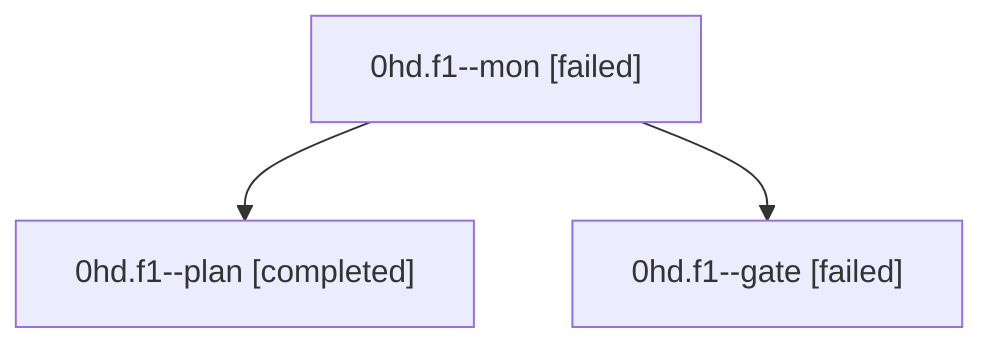

# Family: 0hd.f1

[Agent Hoods](../README.md) / [bbugyi200](../users/bbugyi200/README.md) / [athena](../users/bbugyi200/machines/athena/README.md) / [0hd](../users/bbugyi200/machines/athena/hoods/0hd/README.md) / 0hd.f1

Owner: `bbugyi200.athena` · Hood: `0hd` · Members: 3

## Lineage

The diagram is an optional enhancement; the ordered table below contains the same lineage in accessible text.

| Role | Agent | State | Model / provider | Timing | Commits | Prompt | Chat |
|---|---|---|---|---|---:|---|---|
| mon | 0hd.f1--mon | failed | claude-fable-5 / claude | 2026-09-09T16:39:09.567147+00:00 → 2026-09-09T16:41:36.273842+00:00 | 0 | — | [Chat](../agents/bbugyi200.athena.0hd.f1--mon/chat.md) |
| plan | 0hd.f1--plan | completed | claude-fable-5 / claude | 2026-09-09T16:23:25.030635+00:00 → 2026-09-09T16:36:11.772591+00:00 | 0 | [Prompt](../agents/bbugyi200.athena.0hd.f1--plan/prompt.md) | [Chat](../agents/bbugyi200.athena.0hd.f1--plan/chat.md) |
| gate | 0hd.f1--gate | failed | claude-fable-5 / claude | 2026-09-09T16:35:49.641297+00:00 → 2026-09-09T16:39:11.244861+00:00 | 0 | — | [Chat](../agents/bbugyi200.athena.0hd.f1--gate/chat.md) |

## Neighbors

| Agent | Relation | State |
|---|---|---|
| [0hd](bbugyi200.athena.0hd.md) (family · 7) | ancestor | active 1, completed 3, failed 3 |
