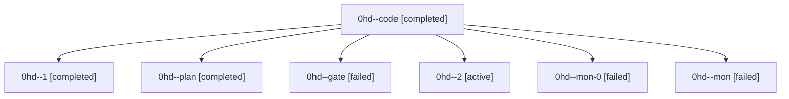

# Family: 0hd

[Agent Hoods](../README.md) / [bbugyi200](../users/bbugyi200/README.md) / [athena](../users/bbugyi200/machines/athena/README.md) / [0hd](../users/bbugyi200/machines/athena/hoods/0hd/README.md) / 0hd

Owner: `bbugyi200.athena` · Hood: `0hd` · Members: 7

## Lineage

The diagram is an optional enhancement; the ordered table below contains the same lineage in accessible text.

| Role | Agent | State | Model / provider | Timing | Commits | Prompt | Chat |
|---|---|---|---|---|---:|---|---|
| code | 0hd--code | completed | gpt-5.5 / codex | 2026-09-09T13:19:15.472178+00:00 → 2026-09-09T14:02:30.353456+00:00 | 0 | [Prompt](../agents/bbugyi200.athena.0hd--code/prompt.md) | [Chat](../agents/bbugyi200.athena.0hd--code/chat.md) |
| 1 | 0hd--1 | completed | gpt-5.5 / codex | 2026-09-09T15:33:55.121110+00:00 → 2026-09-09T15:54:54.989419+00:00 | 0 | [Prompt](../agents/bbugyi200.athena.0hd--1/prompt.md) | [Chat](../agents/bbugyi200.athena.0hd--1/chat.md) |
| plan | 0hd--plan | completed | claude-fable-5 / claude | 2026-09-09T13:09:01.916444+00:00 → 2026-09-09T13:17:36.660785+00:00 | 0 | [Prompt](../agents/bbugyi200.athena.0hd--plan/prompt.md) | [Chat](../agents/bbugyi200.athena.0hd--plan/chat.md) |
| gate | 0hd--gate | failed | claude-fable-5 / claude | 2026-09-09T13:17:20.853634+00:00 → 2026-09-09T13:19:04.664296+00:00 | 0 | — | [Chat](../agents/bbugyi200.athena.0hd--gate/chat.md) |
| 2 | 0hd--2 | active | gpt-5.5 / codex | 2026-09-09T16:23:27.972056+00:00 | [1](../agents/bbugyi200.athena.0hd--2/README.md#commits) | [Prompt](../agents/bbugyi200.athena.0hd--2/prompt.md) | — |
| mon-0 | 0hd--mon-0 | failed | gpt-5.5 / codex | 2026-09-09T15:54:44.626650+00:00 → 2026-09-09T16:22:44.924768+00:00 | 0 | — | [Chat](../agents/bbugyi200.athena.0hd--mon-0/chat.md) |
| mon | 0hd--mon | failed | gpt-5.5 / codex | 2026-09-09T14:02:19.941975+00:00 → 2026-09-09T15:33:32.663859+00:00 | 0 | — | [Chat](../agents/bbugyi200.athena.0hd--mon/chat.md) |

## Commits

| Role | Repo | Commit | Subject | Committed |
|---|---|---|---|---|
| 2 | sase | [`633af68`](https://github.com/sase-org/sase/commit/633af6862f034436c031ae870f84d1ab59e22238) | fix(usage): tolerate Claude and Codex probe drift | 2026-09-09 12:53:00 EDT |

## Neighbors

| Agent | Relation | State |
|---|---|---|
| [0hd.f1](bbugyi200.athena.0hd.f1.md) (family · 3) | descendant | completed 1, failed 2 |
