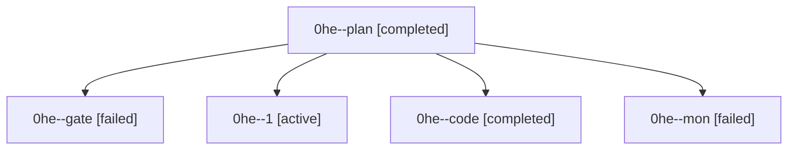

# Family: 0he

[Agent Hoods](../README.md) / [bbugyi200](../users/bbugyi200/README.md) / [athena](../users/bbugyi200/machines/athena/README.md) / [0he](../users/bbugyi200/machines/athena/hoods/0he/README.md) / 0he

Owner: `bbugyi200.athena` · Hood: `0he` · Members: 5

## Lineage

The diagram is an optional enhancement; the ordered table below contains the same lineage in accessible text.

| Role | Agent | State | Model / provider | Timing | Commits | Prompt | Chat |
|---|---|---|---|---|---:|---|---|
| plan | 0he--plan | completed | gpt-6-astra / codex | 2026-09-09T13:37:51.474894+00:00 → 2026-09-09T13:47:24.648899+00:00 | 0 | [Prompt](../agents/bbugyi200.athena.0he--plan/prompt.md) | [Chat](../agents/bbugyi200.athena.0he--plan/chat.md) |
| gate | 0he--gate | failed | gpt-6-astra / codex | 2026-09-09T13:47:15.942117+00:00 → 2026-09-09T13:49:48.046039+00:00 | 0 | — | [Chat](../agents/bbugyi200.athena.0he--gate/chat.md) |
| 1 | 0he--1 | active | gpt-5.5 / codex | 2026-09-09T14:49:42.527029+00:00 | [1](../agents/bbugyi200.athena.0he--1/README.md#commits) | [Prompt](../agents/bbugyi200.athena.0he--1/prompt.md) | — |
| code | 0he--code | completed | gpt-5.5 / codex | 2026-09-09T13:49:56.052750+00:00 → 2026-09-09T14:28:57.329740+00:00 | 0 | [Prompt](../agents/bbugyi200.athena.0he--code/prompt.md) | [Chat](../agents/bbugyi200.athena.0he--code/chat.md) |
| mon | 0he--mon | failed | gpt-5.5 / codex | 2026-09-09T14:28:31.849663+00:00 → 2026-09-09T14:49:28.200925+00:00 | 0 | — | [Chat](../agents/bbugyi200.athena.0he--mon/chat.md) |

## Commits

| Role | Repo | Commit | Subject | Committed |
|---|---|---|---|---|
| 1 | sase | [`562e855`](https://github.com/sase-org/sase/commit/562e855bc0c5f1d45d9893dca4d3540733cdcff7) | feat(pager): redesign breadcrumb trail chrome | 2026-09-09 10:52:11 EDT |
