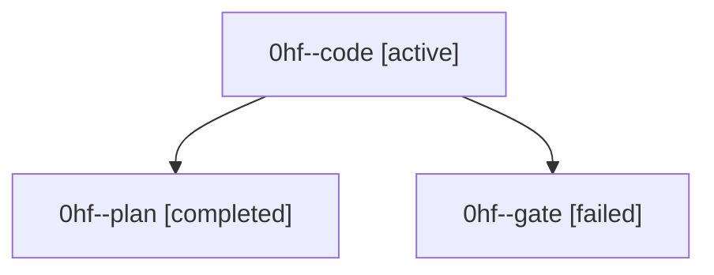

# Family: 0hf

[Agent Hoods](../README.md) / [bbugyi200](../users/bbugyi200/README.md) / [athena](../users/bbugyi200/machines/athena/README.md) / [0hf](../users/bbugyi200/machines/athena/hoods/0hf/README.md) / 0hf

Owner: `bbugyi200.athena` · Hood: `0hf` · Members: 3

## Lineage

The diagram is an optional enhancement; the ordered table below contains the same lineage in accessible text.

| Role | Agent | State | Model / provider | Timing | Commits | Prompt | Chat |
|---|---|---|---|---|---:|---|---|
| code | 0hf--code | active | gpt-5.5 / codex | 2026-09-09T15:03:00.940933+00:00 | 0 | [Prompt](../agents/bbugyi200.athena.0hf--code/prompt.md) | — |
| plan | 0hf--plan | completed | gpt-5.6-sol / codex | 2026-09-09T14:54:16.567631+00:00 → 2026-09-09T15:02:05.126238+00:00 | 0 | [Prompt](../agents/bbugyi200.athena.0hf--plan/prompt.md) | [Chat](../agents/bbugyi200.athena.0hf--plan/chat.md) |
| gate | 0hf--gate | failed | gpt-5.6-sol / codex | 2026-09-09T15:01:56.489619+00:00 → 2026-09-09T15:02:53.389583+00:00 | 0 | — | [Chat](../agents/bbugyi200.athena.0hf--gate/chat.md) |
