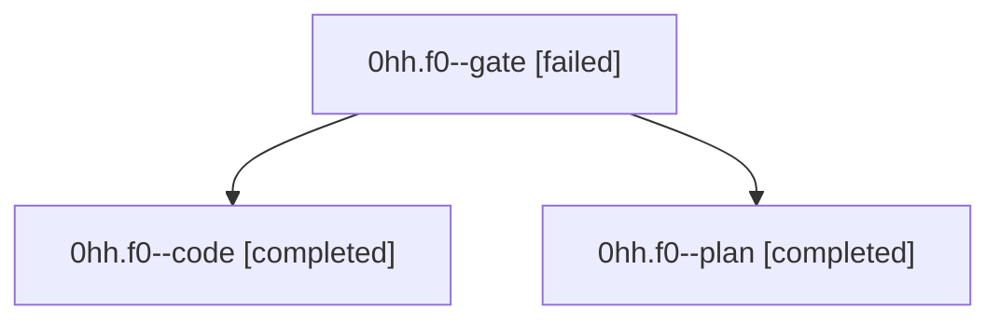

# Family: 0hh.f0

[Agent Hoods](../README.md) / [bbugyi200](../users/bbugyi200/README.md) / [athena](../users/bbugyi200/machines/athena/README.md) / [0hh](../users/bbugyi200/machines/athena/hoods/0hh/README.md) / 0hh.f0

Owner: `bbugyi200.athena` · Hood: `0hh` · Members: 3

## Lineage

The diagram is an optional enhancement; the ordered table below contains the same lineage in accessible text.

| Role | Agent | State | Model / provider | Timing | Commits | Prompt | Chat |
|---|---|---|---|---|---:|---|---|
| gate | 0hh.f0--gate | failed | gpt-6-astra / codex | 2026-09-09T17:35:01.105926+00:00 → 2026-09-09T17:41:58.524090+00:00 | 0 | — | [Chat](../agents/bbugyi200.athena.0hh.f0--gate/chat.md) |
| code | 0hh.f0--code | completed | gpt-5.5 / codex | 2026-09-09T17:42:06.171792+00:00 → 2026-09-09T18:55:26.215966+00:00 | [1](../agents/bbugyi200.athena.0hh.f0--code/README.md#commits) | [Prompt](../agents/bbugyi200.athena.0hh.f0--code/prompt.md) | [Chat](../agents/bbugyi200.athena.0hh.f0--code/chat.md) |
| plan | 0hh.f0--plan | completed | gpt-6-astra / codex | 2026-09-09T17:25:29.866046+00:00 → 2026-09-09T17:35:18.381314+00:00 | 0 | [Prompt](../agents/bbugyi200.athena.0hh.f0--plan/prompt.md) | [Chat](../agents/bbugyi200.athena.0hh.f0--plan/chat.md) |

## Commits

| Role | Repo | Commit | Subject | Committed |
|---|---|---|---|---|
| code | sase | [`63ec413`](https://github.com/sase-org/sase/commit/63ec413b60492082e0a7a95e142417d74e05150b) | feat(feature-flags): clean unknown saved flags on startup | 2026-09-09 14:48:52 EDT |

## Neighbors

| Agent | Relation | State |
|---|---|---|
| [0hh](../agents/bbugyi200.athena.0hh/README.md) | ancestor | dismissed |
