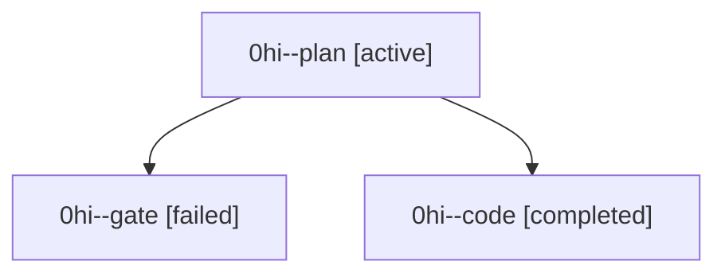

# Family: 0hi

[Agent Hoods](../README.md) / [bbugyi200](../users/bbugyi200/README.md) / [athena](../users/bbugyi200/machines/athena/README.md) / [0hi](../users/bbugyi200/machines/athena/hoods/0hi/README.md) / 0hi

Owner: `bbugyi200.athena` · Hood: `0hi` · Members: 3

## Lineage

The diagram is an optional enhancement; the ordered table below contains the same lineage in accessible text.

| Role | Agent | State | Model / provider | Timing | Commits | Prompt | Chat |
|---|---|---|---|---|---:|---|---|
| plan | 0hi--plan | active | claude-fable-5 / claude | 2026-09-09T17:21:56.091702+00:00 | 0 | [Prompt](../agents/bbugyi200.athena.0hi--plan/prompt.md) | [Chat](../agents/bbugyi200.athena.0hi--plan/chat.md) |
| gate | 0hi--gate | failed | claude-fable-5 / claude | 2026-09-09T17:36:15.420363+00:00 → 2026-09-09T17:41:48.421139+00:00 | 0 | — | [Chat](../agents/bbugyi200.athena.0hi--gate/chat.md) |
| code | 0hi--code | completed | gpt-5.5 / codex | 2026-09-09T17:41:54.396336+00:00 → 2026-09-09T18:57:14.313029+00:00 | [1](../agents/bbugyi200.athena.0hi--code/README.md#commits) | [Prompt](../agents/bbugyi200.athena.0hi--code/prompt.md) | [Chat](../agents/bbugyi200.athena.0hi--code/chat.md) |

## Commits

| Role | Repo | Commit | Subject | Committed |
|---|---|---|---|---|
| code | sase | [`baead1f`](https://github.com/sase-org/sase/commit/baead1f50ec68454462989426e73b169e35896f5) | fix(tui): support ctrl bracket insert escape | 2026-09-09 14:53:35 EDT |
