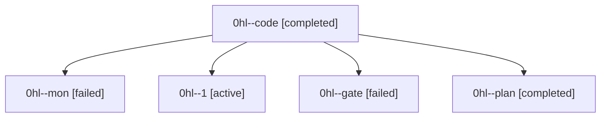

# Family: 0hl

[Agent Hoods](../README.md) / [bbugyi200](../users/bbugyi200/README.md) / [athena](../users/bbugyi200/machines/athena/README.md) / [0hl](../users/bbugyi200/machines/athena/hoods/0hl/README.md) / 0hl

Owner: `bbugyi200.athena` · Hood: `0hl` · Members: 5

## Lineage

The diagram is an optional enhancement; the ordered table below contains the same lineage in accessible text.

| Role | Agent | State | Model / provider | Timing | Commits | Prompt | Chat |
|---|---|---|---|---|---:|---|---|
| code | 0hl--code | completed | gpt-5.5 / codex | 2026-09-10T11:55:53.943299+00:00 → 2026-09-10T12:28:48.692162+00:00 | 0 | [Prompt](../agents/bbugyi200.athena.0hl--code/prompt.md) | [Chat](../agents/bbugyi200.athena.0hl--code/chat.md) |
| mon | 0hl--mon | failed | gpt-5.5 / codex | 2026-09-10T12:28:30.656395+00:00 → 2026-09-10T12:33:20.321226+00:00 | 0 | — | [Chat](../agents/bbugyi200.athena.0hl--mon/chat.md) |
| 1 | 0hl--1 | active | gpt-5.5 / codex | 2026-09-10T12:34:26.831988+00:00 | [1](../agents/bbugyi200.athena.0hl--1/README.md#commits) | [Prompt](../agents/bbugyi200.athena.0hl--1/prompt.md) | — |
| gate | 0hl--gate | failed | gpt-6-astra / codex | 2026-09-10T11:53:55.392286+00:00 → 2026-09-10T11:55:11.531995+00:00 | 0 | — | [Chat](../agents/bbugyi200.athena.0hl--gate/chat.md) |
| plan | 0hl--plan | completed | gpt-6-astra / codex | 2026-09-10T11:49:18.410469+00:00 → 2026-09-10T11:54:05.304090+00:00 | 0 | [Prompt](../agents/bbugyi200.athena.0hl--plan/prompt.md) | [Chat](../agents/bbugyi200.athena.0hl--plan/chat.md) |

## Commits

| Role | Repo | Commit | Subject | Committed |
|---|---|---|---|---|
| 1 | sase | [`f7e3d7c`](https://github.com/sase-org/sase/commit/f7e3d7c634d762e70602f1768c55398585880dbc) | feat(ace): show single waited bead ids | 2026-09-10 09:17:07 EDT |
