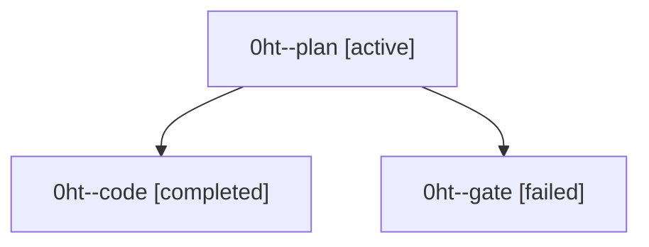

# Family: 0ht

[Agent Hoods](../README.md) / [bbugyi200](../users/bbugyi200/README.md) / [athena](../users/bbugyi200/machines/athena/README.md) / [0ht](../users/bbugyi200/machines/athena/hoods/0ht/README.md) / 0ht

Owner: `bbugyi200.athena` · Hood: `0ht` · Members: 3

## Lineage

The diagram is an optional enhancement; the ordered table below contains the same lineage in accessible text.

| Role | Agent | State | Model / provider | Timing | Commits | Prompt | Chat |
|---|---|---|---|---|---:|---|---|
| plan | 0ht--plan | active | claude-fable-5 / claude | 2026-09-09T19:18:33.841667+00:00 | 0 | [Prompt](../agents/bbugyi200.athena.0ht--plan/prompt.md) | [Chat](../agents/bbugyi200.athena.0ht--plan/chat.md) |
| code | 0ht--code | completed | gpt-5.5 / codex | 2026-09-09T19:30:56.606545+00:00 → 2026-09-09T19:59:35.227541+00:00 | [1](../agents/bbugyi200.athena.0ht--code/README.md#commits) | [Prompt](../agents/bbugyi200.athena.0ht--code/prompt.md) | [Chat](../agents/bbugyi200.athena.0ht--code/chat.md) |
| gate | 0ht--gate | failed | claude-fable-5 / claude | 2026-09-09T19:26:56.377818+00:00 → 2026-09-09T19:30:48.653032+00:00 | 0 | — | [Chat](../agents/bbugyi200.athena.0ht--gate/chat.md) |

## Commits

| Role | Repo | Commit | Subject | Committed |
|---|---|---|---|---|
| code | sase | [`d590e55`](https://github.com/sase-org/sase/commit/d590e558baa1d024a227b5b607dce37ff5ad0b11) | fix(finalizers): scope conflict repair budget per repo | 2026-09-09 15:56:22 EDT |
