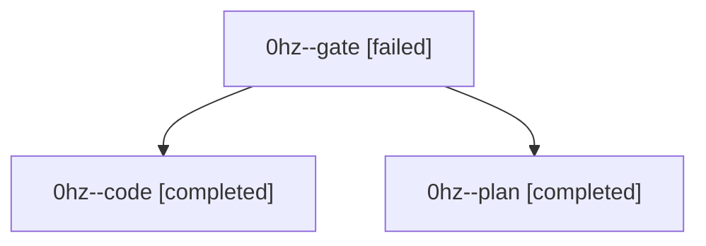

# Family: 0hz

[Agent Hoods](../README.md) / [bbugyi200](../users/bbugyi200/README.md) / [athena](../users/bbugyi200/machines/athena/README.md) / [0hz](../users/bbugyi200/machines/athena/hoods/0hz/README.md) / 0hz

Owner: `bbugyi200.athena` · Hood: `0hz` · Members: 3

## Lineage

The diagram is an optional enhancement; the ordered table below contains the same lineage in accessible text.

| Role | Agent | State | Model / provider | Timing | Commits | Prompt | Chat |
|---|---|---|---|---|---:|---|---|
| gate | 0hz--gate | failed | gpt-5.6-sol / codex | 2026-09-09T22:03:29.881138+00:00 → 2026-09-09T22:07:10.659454+00:00 | 0 | — | [Chat](../agents/bbugyi200.athena.0hz--gate/chat.md) |
| code | 0hz--code | completed | gpt-5.5 / codex | 2026-09-09T22:07:19.455881+00:00 → 2026-09-09T22:20:34.397549+00:00 | 0 | [Prompt](../agents/bbugyi200.athena.0hz--code/prompt.md) | [Chat](../agents/bbugyi200.athena.0hz--code/chat.md) |
| plan | 0hz--plan | completed | gpt-5.6-sol / codex | 2026-09-09T21:57:33.075754+00:00 → 2026-09-09T22:03:44.210850+00:00 | 0 | [Prompt](../agents/bbugyi200.athena.0hz--plan/prompt.md) | [Chat](../agents/bbugyi200.athena.0hz--plan/chat.md) |
