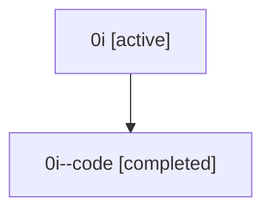

# Family: 0i

Owner: `bbugyi200.athena` · Hood: `0i` · Members: 2

## Lineage

The diagram is an optional enhancement; the ordered table below contains the same lineage in accessible text.

| Role | Agent | State | Model / provider | Timing | Commits | Prompt | Chat |
|---|---|---|---|---|---:|---|---|
| root | 0i | active | claude-fable-5 / claude | 2026-07-07T15:45:37.937448+00:00 | 6 | [Prompt](../agents/bbugyi200.athena.0i/prompt.md) | [Chat](../agents/bbugyi200.athena.0i/chat.md) |
| code | 0i--code | completed | gpt-5.5 / codex | 2026-07-07T15:57:22.257446+00:00 | 0 | — | [Chat](../agents/bbugyi200.athena.0i--code/chat.md) |
