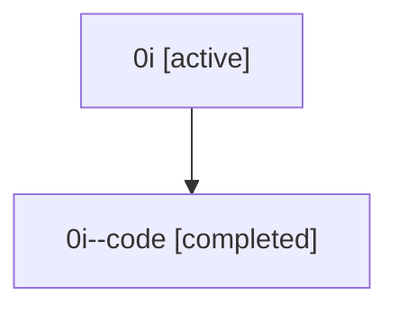

# Family: 0i

[Agent Hoods](../README.md) / [bbugyi200](../users/bbugyi200/README.md) / [athena](../users/bbugyi200/machines/athena/README.md) / [0i](../users/bbugyi200/machines/athena/hoods/0i/README.md) / 0i

Owner: `bbugyi200.athena` · Hood: `0i` · Members: 2

## Lineage

The diagram is an optional enhancement; the ordered table below contains the same lineage in accessible text.

| Role | Agent | State | Model / provider | Timing | Commits | Prompt | Chat |
|---|---|---|---|---|---:|---|---|
| root | 0i | active | claude-fable-5 / claude | 2026-07-07T15:45:37.937448+00:00 | [6](../agents/bbugyi200.athena.0i/README.md#commits) | [Prompt](../agents/bbugyi200.athena.0i/prompt.md) | [Chat](../agents/bbugyi200.athena.0i/chat.md) |
| code | 0i--code | completed | gpt-5.5 / codex | 2026-07-07T15:57:22.257446+00:00 | 0 | — | [Chat](../agents/bbugyi200.athena.0i--code/chat.md) |

## Commits

| Role | Repo | Commit | Subject | Committed |
|---|---|---|---|---|
| root | sase | [`54e5c19`](https://github.com/sase-org/sase/commit/54e5c19b245a0d54608363ba743ec3a849fb56f4) | chore: Add SDD prompt and plan for jump\_all\_scroll | 2026-06-02 21:19:04 EDT |
| root | sase | [`9437080`](https://github.com/sase-org/sase/commit/94370802ffcb6025047069b1ed16adcc2bc1dea8) | fix: keep jump-all scroll keys from dismissing | 2026-06-02 21:25:47 EDT |
| root | sase | [`12243a7`](https://github.com/sase-org/sase/commit/12243a78d1b7f811f952a7d08eea0b1efe297916) | chore: Add SDD prompt and plan for atomic\_rust\_dev\_update | 2026-07-06 00:04:12 EDT |
| root | sase | [`44c9096`](https://github.com/sase-org/sase/commit/44c90960ceb99fe30e82bc16fffd690dc2a24b12) | fix: harden dev update rust repair flow | 2026-07-06 00:49:12 EDT |
| root | sase | [`21ce93d`](https://github.com/sase-org/sase/commit/21ce93d0b29c3d92e070b74563b35dd69398788b) | chore: Add SDD prompt and plan for gh\_first\_use\_project\_display | 2026-07-07 11:57:21 EDT |
| root | sase | [`9a30501`](https://github.com/sase-org/sase/commit/9a30501c34416b316c79b2449a90ffc20028c512) | fix: use canonical workspace refs in launches | 2026-07-07 12:07:46 EDT |
