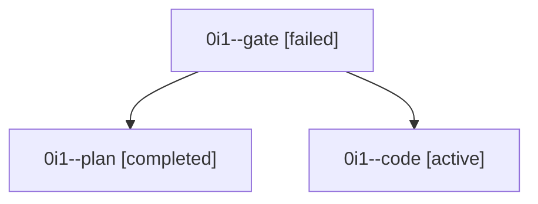

# Family: 0i1

[Agent Hoods](../README.md) / [bbugyi200](../users/bbugyi200/README.md) / [athena](../users/bbugyi200/machines/athena/README.md) / [0i1](../users/bbugyi200/machines/athena/hoods/0i1/README.md) / 0i1

Owner: `bbugyi200.athena` · Hood: `0i1` · Members: 3

## Lineage

The diagram is an optional enhancement; the ordered table below contains the same lineage in accessible text.

| Role | Agent | State | Model / provider | Timing | Commits | Prompt | Chat |
|---|---|---|---|---|---:|---|---|
| gate | 0i1--gate | failed | gpt-6-astra / codex | 2026-09-09T22:10:41.723492+00:00 → 2026-09-09T22:26:07.911399+00:00 | 0 | — | [Chat](../agents/bbugyi200.athena.0i1--gate/chat.md) |
| plan | 0i1--plan | completed | gpt-6-astra / codex | 2026-09-09T22:01:13.125579+00:00 → 2026-09-09T22:11:12.446261+00:00 | 0 | [Prompt](../agents/bbugyi200.athena.0i1--plan/prompt.md) | [Chat](../agents/bbugyi200.athena.0i1--plan/chat.md) |
| code | 0i1--code | active | gpt-5.5 / codex | 2026-09-09T22:26:16.681306+00:00 | [1](../agents/bbugyi200.athena.0i1--code/README.md#commits) | [Prompt](../agents/bbugyi200.athena.0i1--code/prompt.md) | — |

## Commits

| Role | Repo | Commit | Subject | Committed |
|---|---|---|---|---|
| code | sase | [`ea096db`](https://github.com/sase-org/sase/commit/ea096dbfcb3198cac511181c2270d44d478b5b17) | feat(agent): bind prompt stack waits to predecessors | 2026-09-09 20:34:34 EDT |
