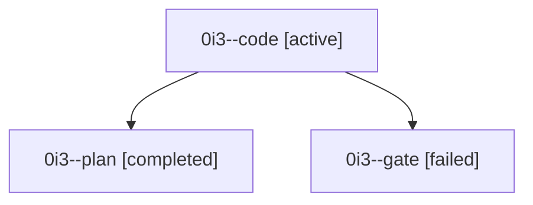

# Family: 0i3

[Agent Hoods](../README.md) / [bbugyi200](../users/bbugyi200/README.md) / [athena](../users/bbugyi200/machines/athena/README.md) / [0i3](../users/bbugyi200/machines/athena/hoods/0i3/README.md) / 0i3

Owner: `bbugyi200.athena` · Hood: `0i3` · Members: 3

## Lineage

The diagram is an optional enhancement; the ordered table below contains the same lineage in accessible text.

| Role | Agent | State | Model / provider | Timing | Commits | Prompt | Chat |
|---|---|---|---|---|---:|---|---|
| code | 0i3--code | active | gpt-5.5 / codex | 2026-09-10T11:56:45.973733+00:00 | [1](../agents/bbugyi200.athena.0i3--code/README.md#commits) | [Prompt](../agents/bbugyi200.athena.0i3--code/prompt.md) | — |
| plan | 0i3--plan | completed | gpt-6-astra / codex | 2026-09-10T11:48:29.583262+00:00 → 2026-09-10T11:54:53.623293+00:00 | 0 | [Prompt](../agents/bbugyi200.athena.0i3--plan/prompt.md) | [Chat](../agents/bbugyi200.athena.0i3--plan/chat.md) |
| gate | 0i3--gate | failed | gpt-6-astra / codex | 2026-09-10T11:54:44.717256+00:00 → 2026-09-10T11:56:16.108350+00:00 | 0 | — | [Chat](../agents/bbugyi200.athena.0i3--gate/chat.md) |

## Commits

| Role | Repo | Commit | Subject | Committed |
|---|---|---|---|---|
| code | sase | [`0523874`](https://github.com/sase-org/sase/commit/0523874af159e7f029ec342218d08d5d2f5b8570) | fix(tui): bind pager tab history | 2026-09-10 08:54:56 EDT |
