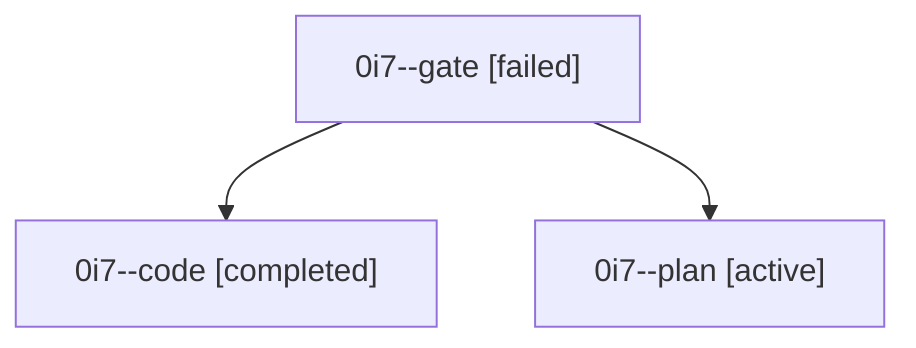

# Family: 0i7

[Agent Hoods](../README.md) / [bbugyi200](../users/bbugyi200/README.md) / [athena](../users/bbugyi200/machines/athena/README.md) / [0i7](../users/bbugyi200/machines/athena/hoods/0i7/README.md) / 0i7

Owner: `bbugyi200.athena` · Hood: `0i7` · Members: 3

## Lineage

The diagram is an optional enhancement; the ordered table below contains the same lineage in accessible text.

| Role | Agent | State | Model / provider | Timing | Commits | Prompt | Chat |
|---|---|---|---|---|---:|---|---|
| gate | 0i7--gate | failed | gpt-6-astra / codex | 2026-09-10T13:32:52.260667+00:00 → 2026-09-10T13:34:17.804779+00:00 | 0 | — | [Chat](../agents/bbugyi200.athena.0i7--gate/chat.md) |
| code | 0i7--code | completed | gpt-5.5 / codex | 2026-09-10T13:35:00.952225+00:00 → 2026-09-10T14:17:16.924459+00:00 | [1](../agents/bbugyi200.athena.0i7--code/README.md#commits) | [Prompt](../agents/bbugyi200.athena.0i7--code/prompt.md) | [Chat](../agents/bbugyi200.athena.0i7--code/chat.md) |
| plan | 0i7--plan | active | gpt-6-astra / codex | 2026-09-10T13:22:58.506126+00:00 | 0 | [Prompt](../agents/bbugyi200.athena.0i7--plan/prompt.md) | [Chat](../agents/bbugyi200.athena.0i7--plan/chat.md) |

## Commits

| Role | Repo | Commit | Subject | Committed |
|---|---|---|---|---|
| code | sase | [`a723858`](https://github.com/sase-org/sase/commit/a723858f27dc48fe42ea849b71f69527046811a0) | fix(agent): preserve wait agent identity | 2026-09-10 10:14:11 EDT |
