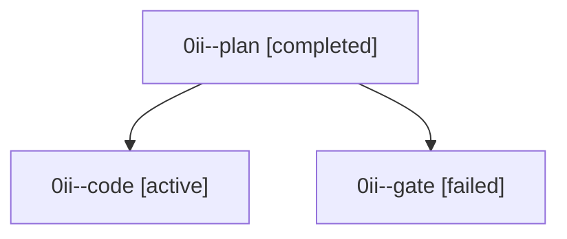

# Family: 0ii

[Agent Hoods](../README.md) / [bbugyi200](../users/bbugyi200/README.md) / [athena](../users/bbugyi200/machines/athena/README.md) / [0ii](../users/bbugyi200/machines/athena/hoods/0ii/README.md) / 0ii

Owner: `bbugyi200.athena` · Hood: `0ii` · Members: 3

## Lineage

The diagram is an optional enhancement; the ordered table below contains the same lineage in accessible text.

| Role | Agent | State | Model / provider | Timing | Commits | Prompt | Chat |
|---|---|---|---|---|---:|---|---|
| plan | 0ii--plan | completed | gpt-5.6-sol / codex | 2026-09-10T20:04:42.404344+00:00 → 2026-09-10T20:12:03.626396+00:00 | 0 | [Prompt](../agents/bbugyi200.athena.0ii--plan/prompt.md) | [Chat](../agents/bbugyi200.athena.0ii--plan/chat.md) |
| code | 0ii--code | active | sonnet / claude | 2026-09-10T20:36:17.208289+00:00 | [1](../agents/bbugyi200.athena.0ii--code/README.md#commits) | [Prompt](../agents/bbugyi200.athena.0ii--code/prompt.md) | — |
| gate | 0ii--gate | failed | gpt-5.6-sol / codex | 2026-09-10T20:34:34.165939+00:00 → 2026-09-10T20:35:26.282243+00:00 | 0 | — | [Chat](../agents/bbugyi200.athena.0ii--gate/chat.md) |

## Commits

| Role | Repo | Commit | Subject | Committed |
|---|---|---|---|---|
| code | sase | [`37b32cf`](https://github.com/sase-org/sase/commit/37b32cfdef053db297332144592d0f2a166152bc) | fix(pager): restore Ctrl+I as the forward-history key | 2026-09-10 16:58:08 EDT |
