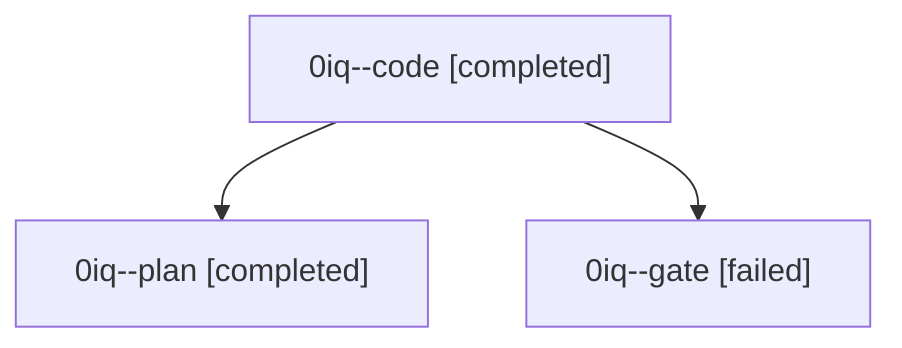

# Family: 0iq

[Agent Hoods](../README.md) / [bbugyi200](../users/bbugyi200/README.md) / [athena](../users/bbugyi200/machines/athena/README.md) / [0iq](../users/bbugyi200/machines/athena/hoods/0iq/README.md) / 0iq

Owner: `bbugyi200.athena` · Hood: `0iq` · Members: 3

## Lineage

The diagram is an optional enhancement; the ordered table below contains the same lineage in accessible text.

| Role | Agent | State | Model / provider | Timing | Commits | Prompt | Chat |
|---|---|---|---|---|---:|---|---|
| code | 0iq--code | completed | grok-4.6 / grok | 2026-09-10T16:34:13.864082+00:00 → 2026-09-10T16:45:38.981975+00:00 | [1](../agents/bbugyi200.athena.0iq--code/README.md#commits) | [Prompt](../agents/bbugyi200.athena.0iq--code/prompt.md) | [Chat](../agents/bbugyi200.athena.0iq--code/chat.md) |
| plan | 0iq--plan | completed | claude-fable-5 / claude | 2026-09-10T16:04:56.803068+00:00 → 2026-09-10T16:13:17.984904+00:00 | 0 | [Prompt](../agents/bbugyi200.athena.0iq--plan/prompt.md) | [Chat](../agents/bbugyi200.athena.0iq--plan/chat.md) |
| gate | 0iq--gate | failed | claude-fable-5 / claude | 2026-09-10T16:14:22.708532+00:00 → 2026-09-10T16:15:36.448406+00:00 | 0 | — | [Chat](../agents/bbugyi200.athena.0iq--gate/chat.md) |

## Commits

| Role | Repo | Commit | Subject | Committed |
|---|---|---|---|---|
| code | sase | [`74de0fa`](https://github.com/sase-org/sase/commit/74de0fa7cc5e36dd153f72e2901863ccb5d4ca43) | fix(sdd): retry sidecar clones without local object reference on any failure | 2026-09-10 12:44:54 EDT |
