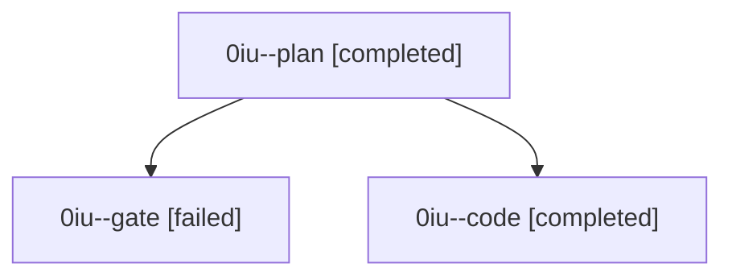

# Family: 0iu

[Agent Hoods](../README.md) / [bbugyi200](../users/bbugyi200/README.md) / [athena](../users/bbugyi200/machines/athena/README.md) / [0iu](../users/bbugyi200/machines/athena/hoods/0iu/README.md) / 0iu

Owner: `bbugyi200.athena` · Hood: `0iu` · Members: 3

## Lineage

The diagram is an optional enhancement; the ordered table below contains the same lineage in accessible text.

| Role | Agent | State | Model / provider | Timing | Commits | Prompt | Chat |
|---|---|---|---|---|---:|---|---|
| plan | 0iu--plan | completed | claude-fable-5 / claude | 2026-09-10T17:33:03.856741+00:00 → 2026-09-10T17:44:24.603756+00:00 | 0 | [Prompt](../agents/bbugyi200.athena.0iu--plan/prompt.md) | [Chat](../agents/bbugyi200.athena.0iu--plan/chat.md) |
| gate | 0iu--gate | failed | claude-fable-5 / claude | 2026-09-10T17:44:55.141289+00:00 → 2026-09-10T17:57:08.270564+00:00 | 0 | — | [Chat](../agents/bbugyi200.athena.0iu--gate/chat.md) |
| code | 0iu--code | completed | sonnet / claude | 2026-09-10T17:57:52.181449+00:00 → 2026-09-10T18:27:58.210214+00:00 | [1](../agents/bbugyi200.athena.0iu--code/README.md#commits) | [Prompt](../agents/bbugyi200.athena.0iu--code/prompt.md) | [Chat](../agents/bbugyi200.athena.0iu--code/chat.md) |

## Commits

| Role | Repo | Commit | Subject | Committed |
|---|---|---|---|---|
| code | sase | [`140c8e4`](https://github.com/sase-org/sase/commit/140c8e42f268e8b67728be1a2f93cf16b85af776) | fix(ace): derive capacity paths from the sharded artifact layout parser | 2026-09-10 14:24:59 EDT |
