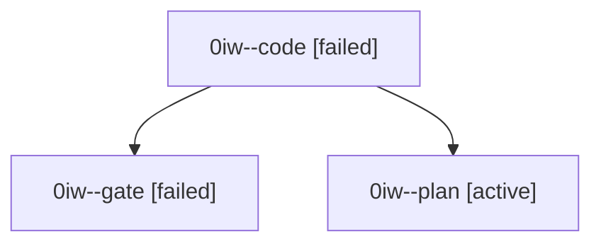

# Family: 0iw

[Agent Hoods](../README.md) / [bbugyi200](../users/bbugyi200/README.md) / [athena](../users/bbugyi200/machines/athena/README.md) / [0iw](../users/bbugyi200/machines/athena/hoods/0iw/README.md) / 0iw

Owner: `bbugyi200.athena` · Hood: `0iw` · Members: 3

## Lineage

The diagram is an optional enhancement; the ordered table below contains the same lineage in accessible text.

| Role | Agent | State | Model / provider | Timing | Commits | Prompt | Chat |
|---|---|---|---|---|---:|---|---|
| code | 0iw--code | failed | sonnet / claude | 2026-09-10T20:41:10.539389+00:00 → 2026-09-10T21:31:19.010161+00:00 | 0 | [Prompt](../agents/bbugyi200.athena.0iw--code/prompt.md) | — |
| gate | 0iw--gate | failed | claude-fable-5 / claude | 2026-09-10T20:38:40.645800+00:00 → 2026-09-10T20:40:29.608424+00:00 | 0 | — | [Chat](../agents/bbugyi200.athena.0iw--gate/chat.md) |
| plan | 0iw--plan | active | claude-fable-5 / claude | 2026-09-10T20:14:23.490689+00:00 | 0 | [Prompt](../agents/bbugyi200.athena.0iw--plan/prompt.md) | [Chat](../agents/bbugyi200.athena.0iw--plan/chat.md) |

## Commits

| Role | Repo | Commit | Subject | Committed |
|---|---|---|---|---|
| — | sase | [`4a862d6`](https://github.com/sase-org/sase/commit/4a862d6ea3ff01525f22f3563234ea8cf9e28156) | feat(ace-tui): render status subgroup banners in by-machine agent grouping | 2026-09-10 17:35:21 EDT |
