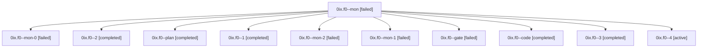

# Family: 0ix.f0

[Agent Hoods](../README.md) / [bbugyi200](../users/bbugyi200/README.md) / [athena](../users/bbugyi200/machines/athena/README.md) / [0ix](../users/bbugyi200/machines/athena/hoods/0ix/README.md) / 0ix.f0

Owner: `bbugyi200.athena` · Hood: `0ix` · Members: 11

## Lineage

The diagram is an optional enhancement; the ordered table below contains the same lineage in accessible text.

| Role | Agent | State | Model / provider | Timing | Commits | Prompt | Chat |
|---|---|---|---|---|---:|---|---|
| mon | 0ix.f0--mon | failed | sonnet / claude | 2026-09-10T21:09:47.560220+00:00 → 2026-09-10T21:11:20.147046+00:00 | 0 | — | [Chat](../agents/bbugyi200.athena.0ix.f0--mon/chat.md) |
| mon-0 | 0ix.f0--mon-0 | failed | sonnet / claude | 2026-09-10T21:13:06.379030+00:00 → 2026-09-10T21:14:36.486908+00:00 | 0 | — | [Chat](../agents/bbugyi200.athena.0ix.f0--mon-0/chat.md) |
| 2 | 0ix.f0--2 | completed | sonnet / claude | 2026-09-10T21:15:55.203084+00:00 → 2026-09-10T21:17:19.378198+00:00 | 0 | [Prompt](../agents/bbugyi200.athena.0ix.f0--2/prompt.md) | [Chat](../agents/bbugyi200.athena.0ix.f0--2/chat.md) |
| plan | 0ix.f0--plan | completed | claude-fable-5 / claude | 2026-09-10T20:30:57.664880+00:00 → 2026-09-10T20:39:46.403597+00:00 | 0 | [Prompt](../agents/bbugyi200.athena.0ix.f0--plan/prompt.md) | [Chat](../agents/bbugyi200.athena.0ix.f0--plan/chat.md) |
| 1 | 0ix.f0--1 | completed | sonnet / claude | 2026-09-10T21:12:22.032319+00:00 → 2026-09-10T21:13:21.195768+00:00 | 0 | [Prompt](../agents/bbugyi200.athena.0ix.f0--1/prompt.md) | [Chat](../agents/bbugyi200.athena.0ix.f0--1/chat.md) |
| mon-2 | 0ix.f0--mon-2 | failed | sonnet / claude | 2026-09-10T21:37:49.275040+00:00 → 2026-09-10T21:48:48.486646+00:00 | 0 | — | [Chat](../agents/bbugyi200.athena.0ix.f0--mon-2/chat.md) |
| mon-1 | 0ix.f0--mon-1 | failed | sonnet / claude | 2026-09-10T21:17:00.113256+00:00 → 2026-09-10T21:20:02.667268+00:00 | 0 | — | [Chat](../agents/bbugyi200.athena.0ix.f0--mon-1/chat.md) |
| gate | 0ix.f0--gate | failed | claude-fable-5 / claude | 2026-09-10T20:53:42.274626+00:00 → 2026-09-10T20:54:52.188174+00:00 | 0 | — | [Chat](../agents/bbugyi200.athena.0ix.f0--gate/chat.md) |
| code | 0ix.f0--code | completed | sonnet / claude | 2026-09-10T20:55:34.862887+00:00 → 2026-09-10T21:10:04.197656+00:00 | 0 | [Prompt](../agents/bbugyi200.athena.0ix.f0--code/prompt.md) | [Chat](../agents/bbugyi200.athena.0ix.f0--code/chat.md) |
| 3 | 0ix.f0--3 | completed | sonnet / claude | 2026-09-10T21:21:03.166076+00:00 → 2026-09-10T21:38:17.863088+00:00 | 0 | [Prompt](../agents/bbugyi200.athena.0ix.f0--3/prompt.md) | [Chat](../agents/bbugyi200.athena.0ix.f0--3/chat.md) |
| 4 | 0ix.f0--4 | active | sonnet / claude | 2026-09-10T21:49:54.946506+00:00 | [1](../agents/bbugyi200.athena.0ix.f0--4/README.md#commits) | [Prompt](../agents/bbugyi200.athena.0ix.f0--4/prompt.md) | — |

## Commits

| Role | Repo | Commit | Subject | Committed |
|---|---|---|---|---|
| 4 | sase | [`12f01fb`](https://github.com/sase-org/sase/commit/12f01fbc1c7ad45b520391f35df963554f8f94f0) | feat(llm-provider): fall back to collected usage-window data for disable duration | 2026-09-10 18:00:38 EDT |

## Neighbors

| Agent | Relation | State |
|---|---|---|
| [0ix](bbugyi200.athena.0ix.md) (family · 3) | ancestor | completed 2, failed 1 |
