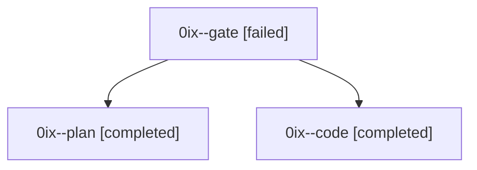

# Family: 0ix

[Agent Hoods](../README.md) / [bbugyi200](../users/bbugyi200/README.md) / [athena](../users/bbugyi200/machines/athena/README.md) / [0ix](../users/bbugyi200/machines/athena/hoods/0ix/README.md) / 0ix

Owner: `bbugyi200.athena` · Hood: `0ix` · Members: 3

## Lineage

The diagram is an optional enhancement; the ordered table below contains the same lineage in accessible text.

| Role | Agent | State | Model / provider | Timing | Commits | Prompt | Chat |
|---|---|---|---|---|---:|---|---|
| gate | 0ix--gate | failed | gpt-6-astra / codex | 2026-09-10T20:39:35.482633+00:00 → 2026-09-10T20:40:46.732697+00:00 | 0 | — | [Chat](../agents/bbugyi200.athena.0ix--gate/chat.md) |
| plan | 0ix--plan | completed | gpt-6-astra / codex | 2026-09-10T20:20:42.686038+00:00 → 2026-09-10T20:29:41.829921+00:00 | 0 | [Prompt](../agents/bbugyi200.athena.0ix--plan/prompt.md) | [Chat](../agents/bbugyi200.athena.0ix--plan/chat.md) |
| code | 0ix--code | completed | gpt-5.5 / codex | 2026-09-10T20:41:36.461966+00:00 → 2026-09-10T21:25:51.331872+00:00 | [1](../agents/bbugyi200.athena.0ix--code/README.md#commits) | [Prompt](../agents/bbugyi200.athena.0ix--code/prompt.md) | [Chat](../agents/bbugyi200.athena.0ix--code/chat.md) |

## Commits

| Role | Repo | Commit | Subject | Committed |
|---|---|---|---|---|
| code | sase | [`63a5dbe`](https://github.com/sase-org/sase/commit/63a5dbef1c732d6c95613244da06abe744320732) | fix(agent): repair provider drain forced-reuse relaunches | 2026-09-10 17:21:35 EDT |

## Neighbors

| Agent | Relation | State |
|---|---|---|
| [0ix.f0](bbugyi200.athena.0ix.f0.md) (family · 11) | descendant | active 1, completed 5, failed 5 |
