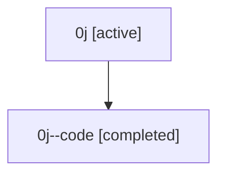

# Family: 0j

Owner: `bbugyi200.athena` · Hood: `0j` · Members: 2

## Lineage

The diagram is an optional enhancement; the ordered table below contains the same lineage in accessible text.

| Role | Agent | State | Model / provider | Timing | Commits | Prompt | Chat |
|---|---|---|---|---|---:|---|---|
| root | 0j | active | claude-fable-5 / claude | 2026-07-07T16:07:35.193931+00:00 | 4 | [Prompt](../agents/bbugyi200.athena.0j/prompt.md) | [Chat](../agents/bbugyi200.athena.0j/chat.md) |
| code | 0j--code | completed | gpt-5.5 / codex | 2026-07-07T16:16:50.391520+00:00 | 1 | — | [Chat](../agents/bbugyi200.athena.0j--code/chat.md) |
