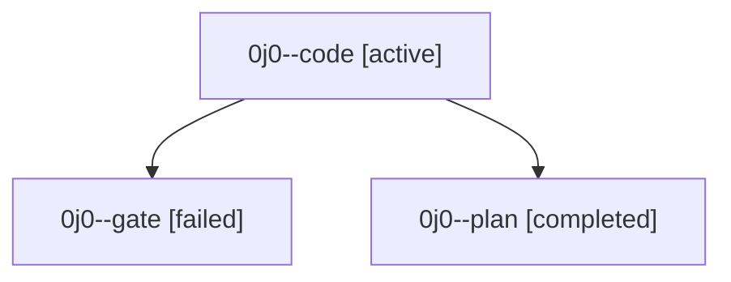

# Family: 0j0

[Agent Hoods](../README.md) / [bbugyi200](../users/bbugyi200/README.md) / [athena](../users/bbugyi200/machines/athena/README.md) / [0j0](../users/bbugyi200/machines/athena/hoods/0j0/README.md) / 0j0

Owner: `bbugyi200.athena` · Hood: `0j0` · Members: 3

## Lineage

The diagram is an optional enhancement; the ordered table below contains the same lineage in accessible text.

| Role | Agent | State | Model / provider | Timing | Commits | Prompt | Chat |
|---|---|---|---|---|---:|---|---|
| code | 0j0--code | active | sonnet / claude | 2026-09-10T21:16:41.854768+00:00 | [1](../agents/bbugyi200.athena.0j0--code/README.md#commits) | [Prompt](../agents/bbugyi200.athena.0j0--code/prompt.md) | — |
| gate | 0j0--gate | failed | gpt-6-astra / codex | 2026-09-10T21:14:35.970287+00:00 → 2026-09-10T21:15:45.062235+00:00 | 0 | — | [Chat](../agents/bbugyi200.athena.0j0--gate/chat.md) |
| plan | 0j0--plan | completed | gpt-6-astra / codex | 2026-09-10T20:53:04.308088+00:00 → 2026-09-10T20:59:41.419391+00:00 | 0 | [Prompt](../agents/bbugyi200.athena.0j0--plan/prompt.md) | [Chat](../agents/bbugyi200.athena.0j0--plan/chat.md) |

## Commits

| Role | Repo | Commit | Subject | Committed |
|---|---|---|---|---|
| code | sase | [`77d8e04`](https://github.com/sase-org/sase/commit/77d8e043383e34ec607cee38e340cfb5c9d3331d) | feat(tui): improve usage window legibility in top bar badges | 2026-09-10 18:08:35 EDT |
