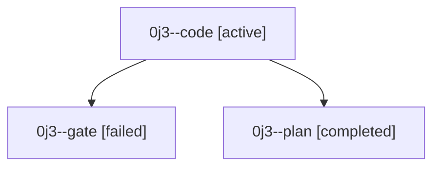

# Family: 0j3

[Agent Hoods](../README.md) / [bbugyi200](../users/bbugyi200/README.md) / [athena](../users/bbugyi200/machines/athena/README.md) / [0j3](../users/bbugyi200/machines/athena/hoods/0j3/README.md) / 0j3

Owner: `bbugyi200.athena` · Hood: `0j3` · Members: 3

## Lineage

The diagram is an optional enhancement; the ordered table below contains the same lineage in accessible text.

| Role | Agent | State | Model / provider | Timing | Commits | Prompt | Chat |
|---|---|---|---|---|---:|---|---|
| code | 0j3--code | active | gpt-5.5 / codex | 2026-09-11T10:43:40.422205+00:00 | [1](../agents/bbugyi200.athena.0j3--code/README.md#commits) | [Prompt](../agents/bbugyi200.athena.0j3--code/prompt.md) | — |
| gate | 0j3--gate | failed | claude-fable-5 / claude | 2026-09-11T10:42:36.888881+00:00 → 2026-09-11T10:43:23.831760+00:00 | 0 | — | [Chat](../agents/bbugyi200.athena.0j3--gate/chat.md) |
| plan | 0j3--plan | completed | claude-fable-5 / claude | 2026-09-11T10:29:25.348229+00:00 → 2026-09-11T10:40:21.414904+00:00 | 0 | [Prompt](../agents/bbugyi200.athena.0j3--plan/prompt.md) | [Chat](../agents/bbugyi200.athena.0j3--plan/chat.md) |

## Commits

| Role | Repo | Commit | Subject | Committed |
|---|---|---|---|---|
| code | sase | [`e6fdda0`](https://github.com/sase-org/sase/commit/e6fdda0179fdcf2dbccd64994557e935dee53b11) | fix(xprompt): ignore prose code-directive mentions | 2026-09-11 07:26:40 EDT |
