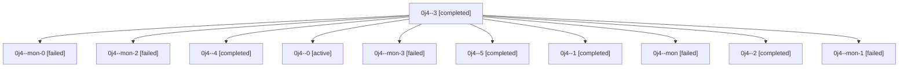

# Family: 0j4

[Agent Hoods](../README.md) / [bbugyi200](../users/bbugyi200/README.md) / [athena](../users/bbugyi200/machines/athena/README.md) / [0j4](../users/bbugyi200/machines/athena/hoods/0j4/README.md) / 0j4

Owner: `bbugyi200.athena` · Hood: `0j4` · Members: 11

## Lineage

The diagram is an optional enhancement; the ordered table below contains the same lineage in accessible text.

| Role | Agent | State | Model / provider | Timing | Commits | Prompt | Chat |
|---|---|---|---|---|---:|---|---|
| 3 | 0j4--3 | completed | sonnet / claude | 2026-09-11T11:19:52.564704+00:00 → 2026-09-11T11:22:55.905397+00:00 | 0 | [Prompt](../agents/bbugyi200.athena.0j4--3/prompt.md) | [Chat](../agents/bbugyi200.athena.0j4--3/chat.md) |
| mon-0 | 0j4--mon-0 | failed | sonnet / claude | 2026-09-11T11:12:51.312703+00:00 → 2026-09-11T11:14:49.288557+00:00 | 0 | — | [Chat](../agents/bbugyi200.athena.0j4--mon-0/chat.md) |
| mon-2 | 0j4--mon-2 | failed | sonnet / claude | 2026-09-11T11:22:09.949644+00:00 → 2026-09-11T11:25:47.909898+00:00 | 0 | — | [Chat](../agents/bbugyi200.athena.0j4--mon-2/chat.md) |
| 4 | 0j4--4 | completed | sonnet / claude | 2026-09-11T11:26:27.667771+00:00 → 2026-09-11T11:28:36.417652+00:00 | 0 | [Prompt](../agents/bbugyi200.athena.0j4--4/prompt.md) | [Chat](../agents/bbugyi200.athena.0j4--4/chat.md) |
| 0 | 0j4--0 | active | sonnet / claude | 2026-09-11T10:32:03.682207+00:00 | 0 | [Prompt](../agents/bbugyi200.athena.0j4--0/prompt.md) | [Chat](../agents/bbugyi200.athena.0j4--0/chat.md) |
| mon-3 | 0j4--mon-3 | failed | sonnet / claude | 2026-09-11T11:28:23.944929+00:00 → 2026-09-11T11:30:26.179917+00:00 | 0 | — | [Chat](../agents/bbugyi200.athena.0j4--mon-3/chat.md) |
| 5 | 0j4--5 | completed | sonnet / claude | 2026-09-11T11:31:08.462117+00:00 → 2026-09-11T11:39:23.302888+00:00 | [1](../agents/bbugyi200.athena.0j4--5/README.md#commits) | [Prompt](../agents/bbugyi200.athena.0j4--5/prompt.md) | [Chat](../agents/bbugyi200.athena.0j4--5/chat.md) |
| 1 | 0j4--1 | completed | sonnet / claude | 2026-09-11T11:10:55.756145+00:00 → 2026-09-11T11:13:32.447913+00:00 | 0 | [Prompt](../agents/bbugyi200.athena.0j4--1/prompt.md) | [Chat](../agents/bbugyi200.athena.0j4--1/chat.md) |
| mon | 0j4--mon | failed | sonnet / claude | 2026-09-11T10:49:10.876769+00:00 → 2026-09-11T11:10:22.933750+00:00 | 0 | — | [Chat](../agents/bbugyi200.athena.0j4--mon/chat.md) |
| 2 | 0j4--2 | completed | sonnet / claude | 2026-09-11T11:15:22.082376+00:00 → 2026-09-11T11:18:04.209829+00:00 | 0 | [Prompt](../agents/bbugyi200.athena.0j4--2/prompt.md) | [Chat](../agents/bbugyi200.athena.0j4--2/chat.md) |
| mon-1 | 0j4--mon-1 | failed | sonnet / claude | 2026-09-11T11:16:55.347009+00:00 → 2026-09-11T11:19:21.595763+00:00 | 0 | — | [Chat](../agents/bbugyi200.athena.0j4--mon-1/chat.md) |

## Commits

| Role | Repo | Commit | Subject | Committed |
|---|---|---|---|---|
| 5 | sase | [`f9680bc`](https://github.com/sase-org/sase/commit/f9680bc6554cae264cf2bb08d8edfba96763048c) | feat(axe): add sase axe restart command | 2026-09-11 07:35:07 EDT |
