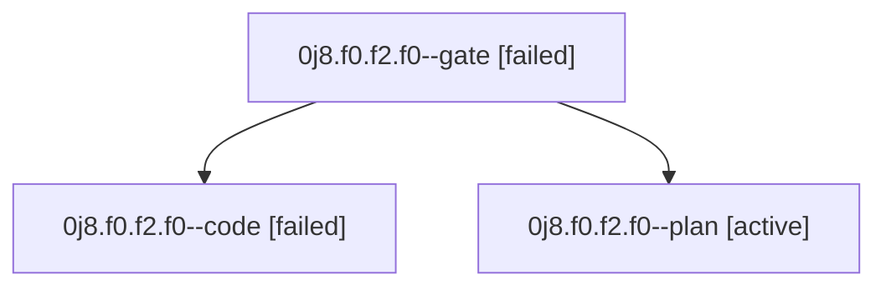

# Family: 0j8.f0.f2.f0

[Agent Hoods](../README.md) / [bbugyi200](../users/bbugyi200/README.md) / [athena](../users/bbugyi200/machines/athena/README.md) / [0j8](../users/bbugyi200/machines/athena/hoods/0j8/README.md) / 0j8.f0.f2.f0

Owner: `bbugyi200.athena` · Hood: `0j8` · Members: 3

## Lineage

The diagram is an optional enhancement; the ordered table below contains the same lineage in accessible text.

| Role | Agent | State | Model / provider | Timing | Commits | Prompt | Chat |
|---|---|---|---|---|---:|---|---|
| gate | 0j8.f0.f2.f0--gate | failed | gpt-6-astra / codex | 2026-09-11T15:58:57.748510+00:00 → 2026-09-11T16:00:45.885777+00:00 | 0 | — | [Chat](../agents/bbugyi200.athena.0j8.f0.f2.f0--gate/chat.md) |
| code | 0j8.f0.f2.f0--code | failed | grok-4.6 / grok | 2026-09-11T16:01:26.760897+00:00 → 2026-09-11T16:31:52.896800+00:00 | 0 | [Prompt](../agents/bbugyi200.athena.0j8.f0.f2.f0--code/prompt.md) | — |
| plan | 0j8.f0.f2.f0--plan | active | gpt-6-astra / codex | 2026-09-11T14:02:57.052299+00:00 | 0 | [Prompt](../agents/bbugyi200.athena.0j8.f0.f2.f0--plan/prompt.md) | [Chat](../agents/bbugyi200.athena.0j8.f0.f2.f0--plan/chat.md) |

## Neighbors

| Agent | Relation | State |
|---|---|---|
| [0j8.f0.f2](bbugyi200.athena.0j8.f0.f2.md) (family · 2) | ancestor | active 1, failed 1 |
| [0j8.f0](bbugyi200.athena.0j8.f0.md) (family · 3) | ancestor | active 1, completed 1, failed 1 |
| [0j8](bbugyi200.athena.0j8.md) (family · 3) | ancestor | active 1, completed 1, failed 1 |
| [0j8.f0.f0](../agents/bbugyi200.athena.0j8.f0.f0/README.md) | 0j8.f0 hood | waiting |
| [0j8.f0.f1](../agents/bbugyi200.athena.0j8.f0.f1/README.md) | 0j8.f0 hood | waiting |
