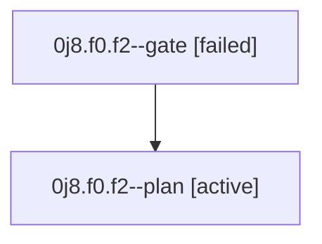

# Family: 0j8.f0.f2

[Agent Hoods](../README.md) / [bbugyi200](../users/bbugyi200/README.md) / [athena](../users/bbugyi200/machines/athena/README.md) / [0j8](../users/bbugyi200/machines/athena/hoods/0j8/README.md) / 0j8.f0.f2

Owner: `bbugyi200.athena` · Hood: `0j8` · Members: 2

## Lineage

The diagram is an optional enhancement; the ordered table below contains the same lineage in accessible text.

| Role | Agent | State | Model / provider | Timing | Commits | Prompt | Chat |
|---|---|---|---|---|---:|---|---|
| gate | 0j8.f0.f2--gate | failed | gpt-6-astra / codex | 2026-09-11T13:55:32.960627+00:00 → 2026-09-11T14:06:07.150208+00:00 | 0 | — | [Chat](../agents/bbugyi200.athena.0j8.f0.f2--gate/chat.md) |
| plan | 0j8.f0.f2--plan | active | gpt-6-astra / codex | 2026-09-11T13:44:51.680872+00:00 | 0 | [Prompt](../agents/bbugyi200.athena.0j8.f0.f2--plan/prompt.md) | [Chat](../agents/bbugyi200.athena.0j8.f0.f2--plan/chat.md) |

## Neighbors

| Agent | Relation | State |
|---|---|---|
| [0j8.f0](bbugyi200.athena.0j8.f0.md) (family · 3) | ancestor | active 1, completed 1, failed 1 |
| [0j8](bbugyi200.athena.0j8.md) (family · 3) | ancestor | active 1, completed 1, failed 1 |
| [0j8.f0.f2.f0](bbugyi200.athena.0j8.f0.f2.f0.md) (family · 3) | descendant | active 1, failed 2 |
| [0j8.f0.f0](../agents/bbugyi200.athena.0j8.f0.f0/README.md) | 0j8.f0 hood | waiting |
| [0j8.f0.f1](../agents/bbugyi200.athena.0j8.f0.f1/README.md) | 0j8.f0 hood | waiting |
