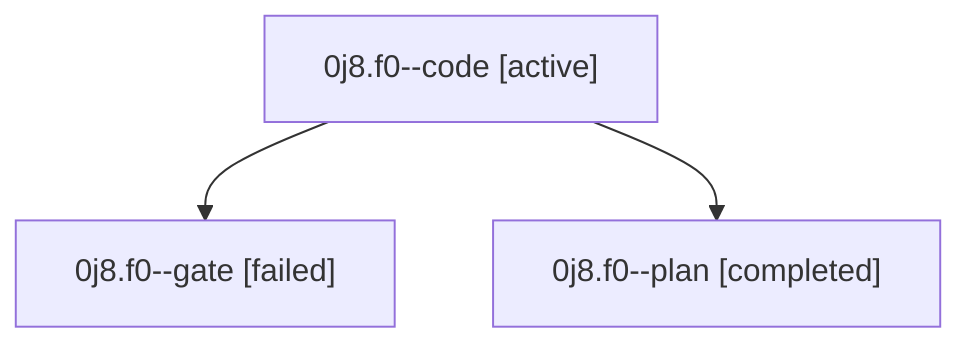

# Family: 0j8.f0

[Agent Hoods](../README.md) / [bbugyi200](../users/bbugyi200/README.md) / [athena](../users/bbugyi200/machines/athena/README.md) / [0j8](../users/bbugyi200/machines/athena/hoods/0j8/README.md) / 0j8.f0

Owner: `bbugyi200.athena` · Hood: `0j8` · Members: 3

## Lineage

The diagram is an optional enhancement; the ordered table below contains the same lineage in accessible text.

| Role | Agent | State | Model / provider | Timing | Commits | Prompt | Chat |
|---|---|---|---|---|---:|---|---|
| code | 0j8.f0--code | active | gpt-5.5 / codex | 2026-09-11T12:54:27.895955+00:00 | 0 | [Prompt](../agents/bbugyi200.athena.0j8.f0--code/prompt.md) | — |
| gate | 0j8.f0--gate | failed | gpt-5.6-sol / codex | 2026-09-11T12:53:19.324159+00:00 → 2026-09-11T12:54:09.699353+00:00 | 0 | — | [Chat](../agents/bbugyi200.athena.0j8.f0--gate/chat.md) |
| plan | 0j8.f0--plan | completed | gpt-5.6-sol / codex | 2026-09-11T12:44:30.932698+00:00 → 2026-09-11T12:50:37.995564+00:00 | 0 | [Prompt](../agents/bbugyi200.athena.0j8.f0--plan/prompt.md) | [Chat](../agents/bbugyi200.athena.0j8.f0--plan/chat.md) |

## Neighbors

| Agent | Relation | State |
|---|---|---|
| [0j8](bbugyi200.athena.0j8.md) (family · 3) | ancestor | completed 2, failed 1 |
