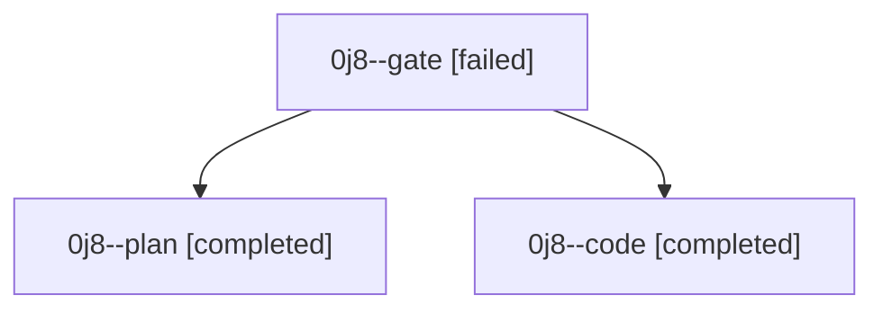

# Family: 0j8

[Agent Hoods](../README.md) / [bbugyi200](../users/bbugyi200/README.md) / [athena](../users/bbugyi200/machines/athena/README.md) / [0j8](../users/bbugyi200/machines/athena/hoods/0j8/README.md) / 0j8

Owner: `bbugyi200.athena` · Hood: `0j8` · Members: 3

## Lineage

The diagram is an optional enhancement; the ordered table below contains the same lineage in accessible text.

| Role | Agent | State | Model / provider | Timing | Commits | Prompt | Chat |
|---|---|---|---|---|---:|---|---|
| gate | 0j8--gate | failed | gpt-6-astra / codex | 2026-09-11T11:50:35.524702+00:00 → 2026-09-11T11:51:35.662659+00:00 | 0 | — | [Chat](../agents/bbugyi200.athena.0j8--gate/chat.md) |
| plan | 0j8--plan | completed | gpt-6-astra / codex | 2026-09-11T11:07:55.874850+00:00 → 2026-09-11T11:15:10.899368+00:00 | 0 | [Prompt](../agents/bbugyi200.athena.0j8--plan/prompt.md) | [Chat](../agents/bbugyi200.athena.0j8--plan/chat.md) |
| code | 0j8--code | completed | gpt-5.5 / codex | 2026-09-11T11:51:55.743430+00:00 → 2026-09-11T12:44:15.037529+00:00 | [1](../agents/bbugyi200.athena.0j8--code/README.md#commits) | [Prompt](../agents/bbugyi200.athena.0j8--code/prompt.md) | [Chat](../agents/bbugyi200.athena.0j8--code/chat.md) |

## Commits

| Role | Repo | Commit | Subject | Committed |
|---|---|---|---|---|
| code | sase | [`ac55d0c`](https://github.com/sase-org/sase/commit/ac55d0c874f1927f0555b3cb56233bf3f2eed449) | feat(tui): group usage window indicators | 2026-09-11 08:42:58 EDT |

## Neighbors

| Agent | Relation | State |
|---|---|---|
| [0j8.f0](bbugyi200.athena.0j8.f0.md) (family · 3) | descendant | active 1, completed 1, failed 1 |
