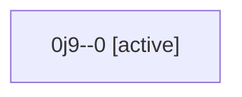

# Family: 0j9

[Agent Hoods](../README.md) / [bbugyi200](../users/bbugyi200/README.md) / [athena](../users/bbugyi200/machines/athena/README.md) / [0j9](../users/bbugyi200/machines/athena/hoods/0j9/README.md) / 0j9

Owner: `bbugyi200.athena` · Hood: `0j9` · Members: 1

## Lineage

The diagram is an optional enhancement; the ordered table below contains the same lineage in accessible text.

| Role | Agent | State | Model / provider | Timing | Commits | Prompt | Chat |
|---|---|---|---|---|---:|---|---|
| 0 | 0j9--0 | active | gpt-6-astra / codex | 2026-09-12T06:45:00.264628+00:00 | [1](../agents/bbugyi200.athena.0j9--0/README.md#commits) | [Prompt](../agents/bbugyi200.athena.0j9--0/prompt.md) | — |

## Commits

| Role | Repo | Commit | Subject | Committed |
|---|---|---|---|---|
| 0 | sase | [`3703e0b`](https://github.com/sase-org/sase/commit/3703e0bfd8b416cf4925887674a05d9cff7aed9d) | chore(config): raise pipe limit for notification task review chain | 2026-09-12 03:03:56 EDT |
