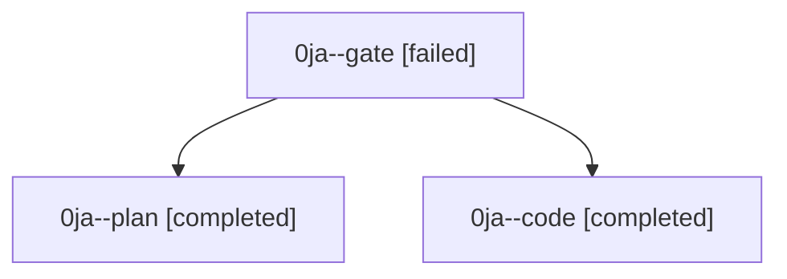

# Family: 0ja

[Agent Hoods](../README.md) / [bbugyi200](../users/bbugyi200/README.md) / [athena](../users/bbugyi200/machines/athena/README.md) / [0ja](../users/bbugyi200/machines/athena/hoods/0ja/README.md) / 0ja

Owner: `bbugyi200.athena` · Hood: `0ja` · Members: 3

## Lineage

The diagram is an optional enhancement; the ordered table below contains the same lineage in accessible text.

| Role | Agent | State | Model / provider | Timing | Commits | Prompt | Chat |
|---|---|---|---|---|---:|---|---|
| gate | 0ja--gate | failed | gpt-6-astra / codex | 2026-09-11T12:59:56.340823+00:00 → 2026-09-11T13:01:44.011926+00:00 | 0 | — | [Chat](../agents/bbugyi200.athena.0ja--gate/chat.md) |
| plan | 0ja--plan | completed | gpt-6-astra / codex | 2026-09-11T12:46:52.019548+00:00 → 2026-09-11T12:55:22.988792+00:00 | 0 | [Prompt](../agents/bbugyi200.athena.0ja--plan/prompt.md) | [Chat](../agents/bbugyi200.athena.0ja--plan/chat.md) |
| code | 0ja--code | completed | gpt-5.5 / codex | 2026-09-11T13:02:02.213067+00:00 → 2026-09-11T14:21:54.800820+00:00 | [1](../agents/bbugyi200.athena.0ja--code/README.md#commits) | [Prompt](../agents/bbugyi200.athena.0ja--code/prompt.md) | [Chat](../agents/bbugyi200.athena.0ja--code/chat.md) |

## Commits

| Role | Repo | Commit | Subject | Committed |
|---|---|---|---|---|
| code | sase | [`2b81149`](https://github.com/sase-org/sase/commit/2b811499c4b661f3b98919a27136b133ce1e20c8) | fix(repo): route provider aliases to configured checkouts | 2026-09-11 10:20:25 EDT |
