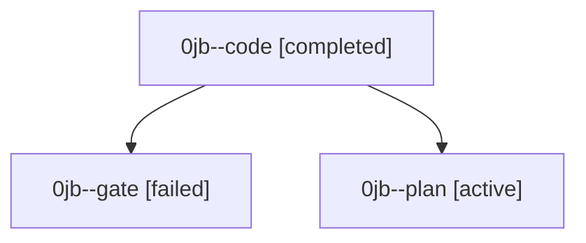

# Family: 0jb

[Agent Hoods](../README.md) / [bbugyi200](../users/bbugyi200/README.md) / [athena](../users/bbugyi200/machines/athena/README.md) / [0jb](../users/bbugyi200/machines/athena/hoods/0jb/README.md) / 0jb

Owner: `bbugyi200.athena` · Hood: `0jb` · Members: 3

## Lineage

The diagram is an optional enhancement; the ordered table below contains the same lineage in accessible text.

| Role | Agent | State | Model / provider | Timing | Commits | Prompt | Chat |
|---|---|---|---|---|---:|---|---|
| code | 0jb--code | completed | gpt-5.5 / codex | 2026-09-11T13:12:16.236621+00:00 → 2026-09-11T14:15:53.564284+00:00 | [1](../agents/bbugyi200.athena.0jb--code/README.md#commits) | [Prompt](../agents/bbugyi200.athena.0jb--code/prompt.md) | [Chat](../agents/bbugyi200.athena.0jb--code/chat.md) |
| gate | 0jb--gate | failed | gpt-6-astra / codex | 2026-09-11T13:09:46.284790+00:00 → 2026-09-11T13:11:55.480539+00:00 | 0 | — | [Chat](../agents/bbugyi200.athena.0jb--gate/chat.md) |
| plan | 0jb--plan | active | gpt-6-astra / codex | 2026-09-11T12:57:58.446747+00:00 | 0 | [Prompt](../agents/bbugyi200.athena.0jb--plan/prompt.md) | [Chat](../agents/bbugyi200.athena.0jb--plan/chat.md) |

## Commits

| Role | Repo | Commit | Subject | Committed |
|---|---|---|---|---|
| code | sase | [`e0aa727`](https://github.com/sase-org/sase/commit/e0aa727b6c70717f0ca570ee70a258c31dd69c8c) | fix: recover sidecar publication retries | 2026-09-11 10:08:54 EDT |
