# Family: 0je

[Agent Hoods](../README.md) / [bbugyi200](../users/bbugyi200/README.md) / [athena](../users/bbugyi200/machines/athena/README.md) / [0je](../users/bbugyi200/machines/athena/hoods/0je/README.md) / 0je

Owner: `bbugyi200.athena` · Hood: `0je` · Members: 16

## Lineage

```mermaid
flowchart TD
  n0["0je--gate [failed]"]
  n1["0je--code [completed]"]
  n0 --> n1
  n2["0je--mon-0 [failed]"]
  n0 --> n2
  n3["0je--mon-2 [failed]"]
  n0 --> n3
  n4["0je--mon-1 [failed]"]
  n0 --> n4
  n5["0je--mon [failed]"]
  n0 --> n5
  n6["0je--2 [completed]"]
  n0 --> n6
  n7["0je--plan [active]"]
  n0 --> n7
  n8["0je--4 [completed]"]
  n0 --> n8
  n9["0je--5 [completed]"]
  n0 --> n9
  n10["0je--6 [completed]"]
  n0 --> n10
  n11["0je--mon-4 [failed]"]
  n0 --> n11
  n12["0je--mon-3 [failed]"]
  n0 --> n12
  n13["0je--3 [completed]"]
  n0 --> n13
  n14["0je--mon-5 [failed]"]
  n0 --> n14
  n15["0je--1 [completed]"]
  n0 --> n15
```

The diagram is an optional enhancement; the ordered table below contains the same lineage in accessible text.

| Role | Agent | State | Model / provider | Timing | Commits | Prompt | Chat |
|---|---|---|---|---|---:|---|---|
| gate | 0je--gate | failed | gpt-6-astra / codex | 2026-09-11T14:07:30.061894+00:00 → 2026-09-11T14:16:25.594953+00:00 | 0 | — | [Chat](../agents/bbugyi200.athena.0je--gate/chat.md) |
| code | 0je--code | completed | grok-4.6 / grok | 2026-09-11T14:17:04.158102+00:00 → 2026-09-11T15:29:24.546583+00:00 | [1](../agents/bbugyi200.athena.0je--code/README.md#commits) | [Prompt](../agents/bbugyi200.athena.0je--code/prompt.md) | [Chat](../agents/bbugyi200.athena.0je--code/chat.md) |
| mon-0 | 0je--mon-0 | failed | grok-4.6 / grok | 2026-09-11T15:49:00.659173+00:00 → 2026-09-11T15:50:36.205471+00:00 | 0 | — | [Chat](../agents/bbugyi200.athena.0je--mon-0/chat.md) |
| mon-2 | 0je--mon-2 | failed | grok-4.6 / grok | 2026-09-11T16:16:52.476456+00:00 → 2026-09-11T16:23:36.887208+00:00 | 0 | — | [Chat](../agents/bbugyi200.athena.0je--mon-2/chat.md) |
| mon-1 | 0je--mon-1 | failed | grok-4.6 / grok | 2026-09-11T16:02:34.713008+00:00 → 2026-09-11T16:05:07.013205+00:00 | 0 | — | [Chat](../agents/bbugyi200.athena.0je--mon-1/chat.md) |
| mon | 0je--mon | failed | grok-4.6 / grok | 2026-09-11T15:29:03.354693+00:00 → 2026-09-11T15:37:49.482101+00:00 | 0 | — | [Chat](../agents/bbugyi200.athena.0je--mon/chat.md) |
| 2 | 0je--2 | completed | grok-4.6 / grok | 2026-09-11T15:51:33.418630+00:00 → 2026-09-11T16:03:03.571311+00:00 | 0 | [Prompt](../agents/bbugyi200.athena.0je--2/prompt.md) | [Chat](../agents/bbugyi200.athena.0je--2/chat.md) |
| plan | 0je--plan | active | gpt-6-astra / codex | 2026-09-11T13:53:51.295609+00:00 | 0 | [Prompt](../agents/bbugyi200.athena.0je--plan/prompt.md) | [Chat](../agents/bbugyi200.athena.0je--plan/chat.md) |
| 4 | 0je--4 | completed | grok-4.6 / grok | 2026-09-11T16:25:12.468659+00:00 → 2026-09-11T16:45:55.503790+00:00 | 0 | [Prompt](../agents/bbugyi200.athena.0je--4/prompt.md) | [Chat](../agents/bbugyi200.athena.0je--4/chat.md) |
| 5 | 0je--5 | completed | grok-4.6 / grok | 2026-09-11T16:49:43.941163+00:00 → 2026-09-11T16:56:47.999724+00:00 | 0 | [Prompt](../agents/bbugyi200.athena.0je--5/prompt.md) | [Chat](../agents/bbugyi200.athena.0je--5/chat.md) |
| 6 | 0je--6 | completed | grok-4.6 / grok | 2026-09-11T17:04:39.617877+00:00 → 2026-09-11T17:10:51.347305+00:00 | 0 | [Prompt](../agents/bbugyi200.athena.0je--6/prompt.md) | [Chat](../agents/bbugyi200.athena.0je--6/chat.md) |
| mon-4 | 0je--mon-4 | failed | grok-4.6 / grok | 2026-09-11T16:56:30.710455+00:00 → 2026-09-11T17:04:36.766186+00:00 | 0 | — | [Chat](../agents/bbugyi200.athena.0je--mon-4/chat.md) |
| mon-3 | 0je--mon-3 | failed | grok-4.6 / grok | 2026-09-11T16:45:35.667116+00:00 → 2026-09-11T16:49:37.089501+00:00 | 0 | — | [Chat](../agents/bbugyi200.athena.0je--mon-3/chat.md) |
| 3 | 0je--3 | completed | grok-4.6 / grok | 2026-09-11T16:05:08.833674+00:00 → 2026-09-11T16:18:28.191973+00:00 | 0 | [Prompt](../agents/bbugyi200.athena.0je--3/prompt.md) | [Chat](../agents/bbugyi200.athena.0je--3/chat.md) |
| mon-5 | 0je--mon-5 | failed | grok-4.6 / grok | 2026-09-11T17:10:40.640909+00:00 → 2026-09-11T17:19:44.730227+00:00 | 0 | — | [Chat](../agents/bbugyi200.athena.0je--mon-5/chat.md) |
| 1 | 0je--1 | completed | grok-4.6 / grok | 2026-09-11T15:38:38.924919+00:00 → 2026-09-11T15:49:17.172369+00:00 | 0 | [Prompt](../agents/bbugyi200.athena.0je--1/prompt.md) | [Chat](../agents/bbugyi200.athena.0je--1/chat.md) |

## Commits

| Role | Repo | Commit | Subject | Committed |
|---|---|---|---|---|
| code | sase | [`db535fa`](https://github.com/sase-org/sase/commit/db535fabda4620af1e4123630f41a18d4636fce0) | fix(llm-provider): collect Grok omitted-zero billing through core | 2026-09-11 11:21:47 EDT |
