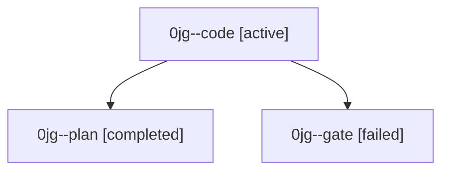

# Family: 0jg

[Agent Hoods](../README.md) / [bbugyi200](../users/bbugyi200/README.md) / [athena](../users/bbugyi200/machines/athena/README.md) / [0jg](../users/bbugyi200/machines/athena/hoods/0jg/README.md) / 0jg

Owner: `bbugyi200.athena` · Hood: `0jg` · Members: 3

## Lineage

The diagram is an optional enhancement; the ordered table below contains the same lineage in accessible text.

| Role | Agent | State | Model / provider | Timing | Commits | Prompt | Chat |
|---|---|---|---|---|---:|---|---|
| code | 0jg--code | active | grok-4.6 / grok | 2026-09-11T15:03:53.245968+00:00 | [1](../agents/bbugyi200.athena.0jg--code/README.md#commits) | [Prompt](../agents/bbugyi200.athena.0jg--code/prompt.md) | — |
| plan | 0jg--plan | completed | gpt-6-astra / codex | 2026-09-11T14:48:43.830965+00:00 → 2026-09-11T14:56:56.133810+00:00 | 0 | [Prompt](../agents/bbugyi200.athena.0jg--plan/prompt.md) | [Chat](../agents/bbugyi200.athena.0jg--plan/chat.md) |
| gate | 0jg--gate | failed | gpt-6-astra / codex | 2026-09-11T15:00:02.493853+00:00 → 2026-09-11T15:02:55.072257+00:00 | 0 | — | [Chat](../agents/bbugyi200.athena.0jg--gate/chat.md) |

## Commits

| Role | Repo | Commit | Subject | Committed |
|---|---|---|---|---|
| code | sase | [`71717d9`](https://github.com/sase-org/sase/commit/71717d95a009416058ce7f277009bcf6e2882e2f) | fix(gate-shell): recover approved tale coder handoffs | 2026-09-11 12:42:15 EDT |
