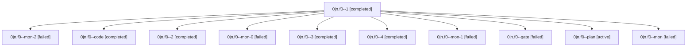

# Family: 0jn.f0

[Agent Hoods](../README.md) / [bbugyi200](../users/bbugyi200/README.md) / [athena](../users/bbugyi200/machines/athena/README.md) / [0jn](../users/bbugyi200/machines/athena/hoods/0jn/README.md) / 0jn.f0

Owner: `bbugyi200.athena` · Hood: `0jn` · Members: 11

## Lineage

The diagram is an optional enhancement; the ordered table below contains the same lineage in accessible text.

| Role | Agent | State | Model / provider | Timing | Commits | Prompt | Chat |
|---|---|---|---|---|---:|---|---|
| 1 | 0jn.f0--1 | completed | grok-4.6 / grok | 2026-09-11T21:47:32.012706+00:00 → 2026-09-11T22:17:02.937901+00:00 | 0 | [Prompt](../agents/bbugyi200.athena.0jn.f0--1/prompt.md) | [Chat](../agents/bbugyi200.athena.0jn.f0--1/chat.md) |
| mon-2 | 0jn.f0--mon-2 | failed | grok-4.6 / grok | 2026-09-11T23:15:12.728939+00:00 → 2026-09-11T23:28:13.151994+00:00 | 0 | — | [Chat](../agents/bbugyi200.athena.0jn.f0--mon-2/chat.md) |
| code | 0jn.f0--code | completed | grok-4.6 / grok | 2026-09-11T21:17:06.464038+00:00 → 2026-09-11T21:43:35.529115+00:00 | 0 | [Prompt](../agents/bbugyi200.athena.0jn.f0--code/prompt.md) | [Chat](../agents/bbugyi200.athena.0jn.f0--code/chat.md) |
| 2 | 0jn.f0--2 | completed | grok-4.6 / grok | 2026-09-11T22:22:37.836371+00:00 → 2026-09-11T22:39:59.828845+00:00 | 0 | [Prompt](../agents/bbugyi200.athena.0jn.f0--2/prompt.md) | [Chat](../agents/bbugyi200.athena.0jn.f0--2/chat.md) |
| mon-0 | 0jn.f0--mon-0 | failed | grok-4.6 / grok | 2026-09-11T22:16:35.243782+00:00 → 2026-09-11T22:22:10.441357+00:00 | 0 | — | [Chat](../agents/bbugyi200.athena.0jn.f0--mon-0/chat.md) |
| 3 | 0jn.f0--3 | completed | grok-4.6 / grok | 2026-09-11T22:57:38.732340+00:00 → 2026-09-11T23:16:14.319840+00:00 | 0 | [Prompt](../agents/bbugyi200.athena.0jn.f0--3/prompt.md) | [Chat](../agents/bbugyi200.athena.0jn.f0--3/chat.md) |
| 4 | 0jn.f0--4 | completed | gpt-5.5 / codex | 2026-09-11T23:28:15.693315+00:00 → 2026-09-12T01:25:45.629784+00:00 | [1](../agents/bbugyi200.athena.0jn.f0--4/README.md#commits) | [Prompt](../agents/bbugyi200.athena.0jn.f0--4/prompt.md) | [Chat](../agents/bbugyi200.athena.0jn.f0--4/chat.md) |
| mon-1 | 0jn.f0--mon-1 | failed | grok-4.6 / grok | 2026-09-11T22:39:39.656575+00:00 → 2026-09-11T22:57:30.860940+00:00 | 0 | — | [Chat](../agents/bbugyi200.athena.0jn.f0--mon-1/chat.md) |
| gate | 0jn.f0--gate | failed | gpt-5.6-sol / codex | 2026-09-11T20:06:25.278275+00:00 → 2026-09-11T20:46:05.258120+00:00 | 0 | — | [Chat](../agents/bbugyi200.athena.0jn.f0--gate/chat.md) |
| plan | 0jn.f0--plan | active | gpt-5.6-sol / codex | 2026-09-11T19:22:34.119838+00:00 | 0 | [Prompt](../agents/bbugyi200.athena.0jn.f0--plan/prompt.md) | [Chat](../agents/bbugyi200.athena.0jn.f0--plan/chat.md) |
| mon | 0jn.f0--mon | failed | grok-4.6 / grok | 2026-09-11T21:43:13.772058+00:00 → 2026-09-11T21:47:18.592190+00:00 | 0 | — | [Chat](../agents/bbugyi200.athena.0jn.f0--mon/chat.md) |

## Commits

| Role | Repo | Commit | Subject | Committed |
|---|---|---|---|---|
| 4 | sase | [`18f472c`](https://github.com/sase-org/sase/commit/18f472c96e8303fdce4eed49402bc4e9bd62c848) | feat(agents): swap query and search keys | 2026-09-11 21:20:16 EDT |

## Neighbors

| Agent | Relation | State |
|---|---|---|
| [0jn](bbugyi200.athena.0jn.md) (family · 2) | ancestor | active 1, failed 1 |
