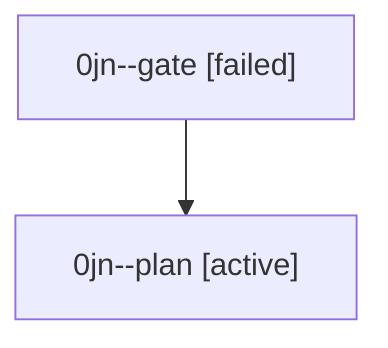

# Family: 0jn

[Agent Hoods](../README.md) / [bbugyi200](../users/bbugyi200/README.md) / [athena](../users/bbugyi200/machines/athena/README.md) / [0jn](../users/bbugyi200/machines/athena/hoods/0jn/README.md) / 0jn

Owner: `bbugyi200.athena` · Hood: `0jn` · Members: 2

## Lineage

The diagram is an optional enhancement; the ordered table below contains the same lineage in accessible text.

| Role | Agent | State | Model / provider | Timing | Commits | Prompt | Chat |
|---|---|---|---|---|---:|---|---|
| gate | 0jn--gate | failed | gpt-6-astra / codex | 2026-09-11T18:21:19.711816+00:00 → 2026-09-11T18:21:57.458588+00:00 | 0 | — | [Chat](../agents/bbugyi200.athena.0jn--gate/chat.md) |
| plan | 0jn--plan | active | gpt-6-astra / codex | 2026-09-11T18:10:47.536015+00:00 | 0 | [Prompt](../agents/bbugyi200.athena.0jn--plan/prompt.md) | [Chat](../agents/bbugyi200.athena.0jn--plan/chat.md) |

## Neighbors

| Agent | Relation | State |
|---|---|---|
| [0jn.f0](bbugyi200.athena.0jn.f0.md) (family · 11) | descendant | active 1, completed 5, failed 5 |
